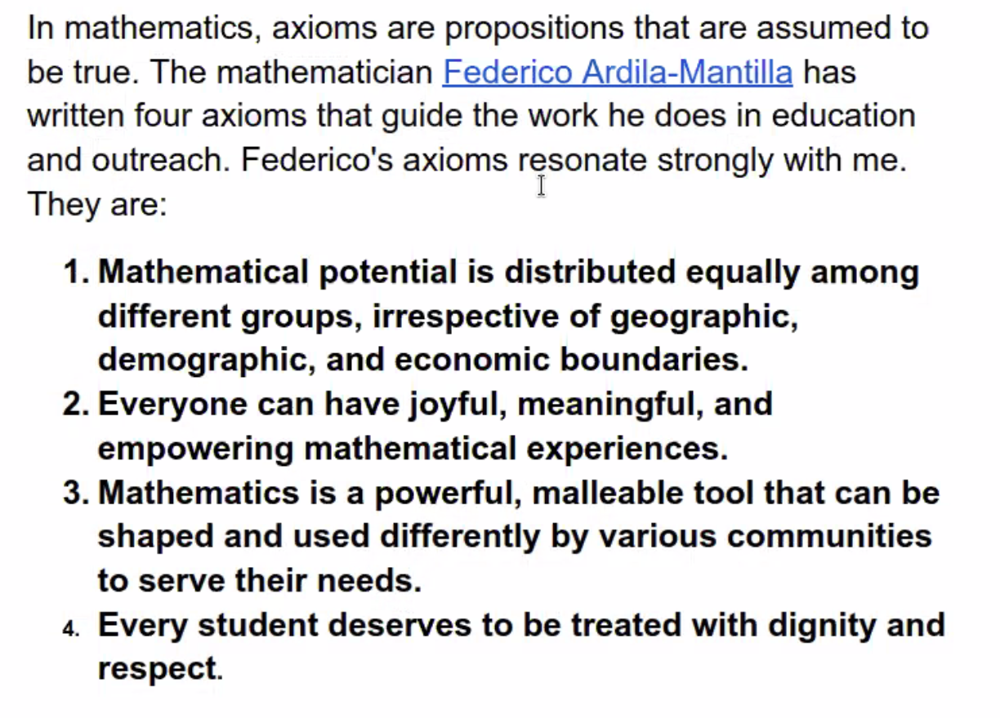

```{r setup, include=FALSE}
knitr::opts_chunk$set(echo = TRUE)
```

# Chaos and Fractals

Today:
- Introductions (to the course and each other) and stories about ourselves, icebreakers
- Axioms for the class + community agreements
- Intro to functions


Our stories were all about different approaches to mathematics through languages 
and signs, so we decided to name our group "the translators".

## Intros to each other

- share an experience of math agony or extacy
- find intersections between your stories in small groups
- find a group name for yourselves based on these intersections


## Intro to the course

The course is addressed to folks from many different math levels, backgrounds,
and experiences.

Mathematics proceeds from axioms. Let's look at a couple of axioms that apply to
teaching:




**Course goals:**

- Stay physically and mentally healthy and maintain intellectual and personal 
connection during a potentially difficult time.
- I want you to gain a solid understanding of the basic mathematical ideas behind 
chaos and fractals. As part of this, I hope you'll leave this course thinking 
somewhat differently about order and disorder, simplicity and complexity.
- I want to help you improve your basic facility with algebra and functions, 
your problem solving skills, your ability to create and interpret different types 
of graphs, and your overall mathematical confidence.
- I want you to gain a sense of how math and physics is done, and gain an awareness 
that these are not static, "dead" disciplines. I want you to gain a greater 
understanding of science as an institution and science as a culture, and how 
science intersects and influences other creative and scholarly areas.
- Have fun while growing and learning.

## Intro to functions

(next class)

```{r}

```

