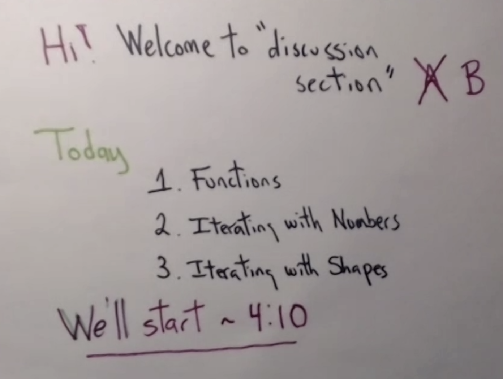
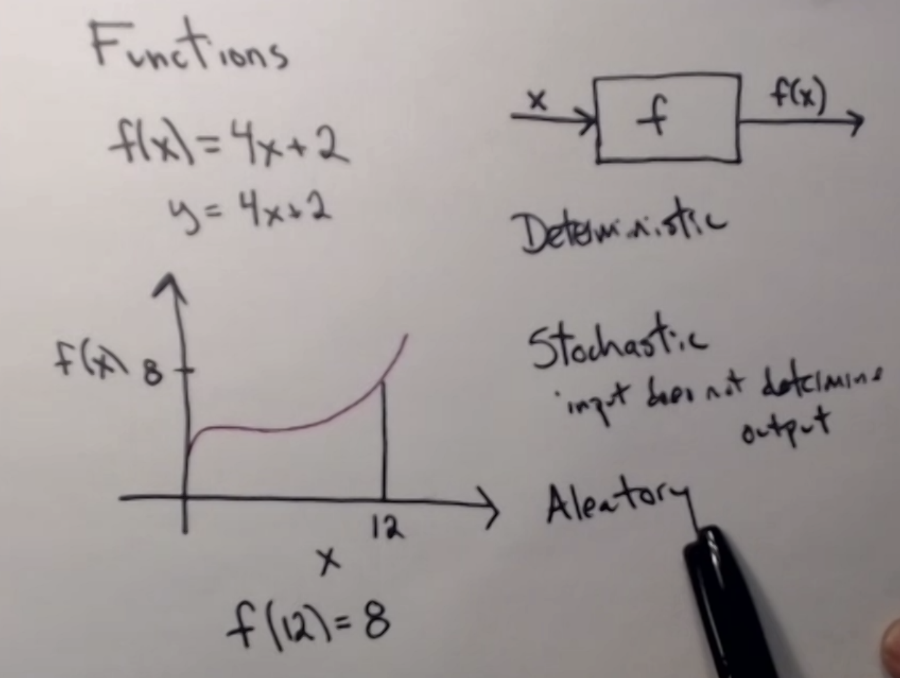
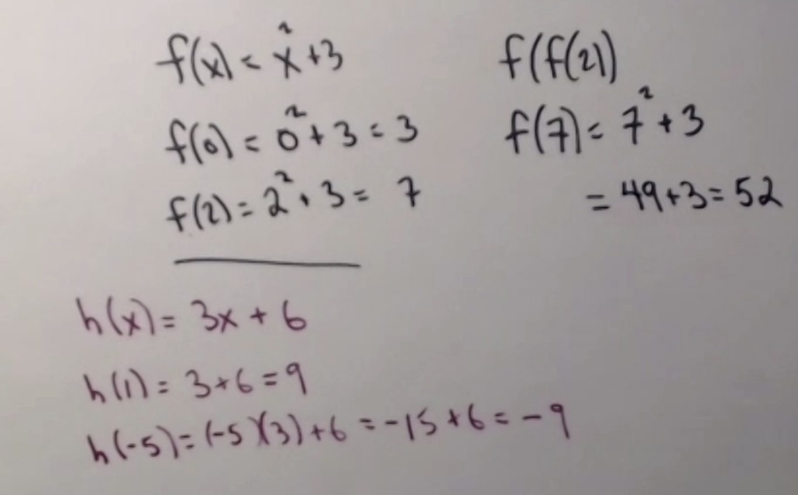
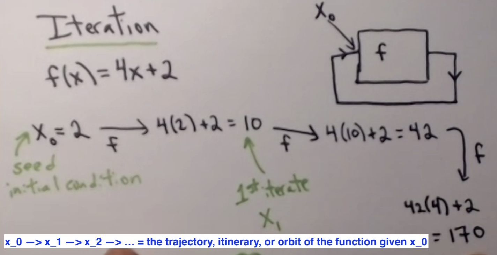
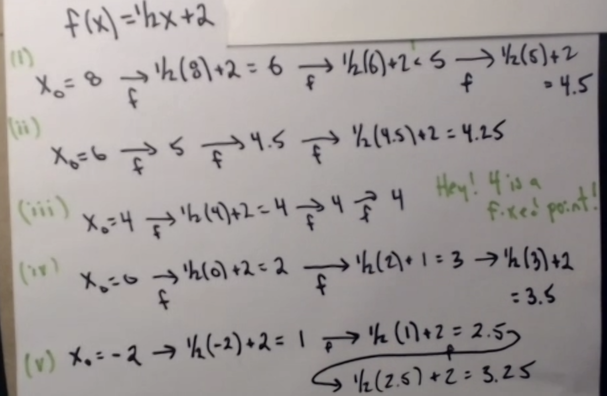
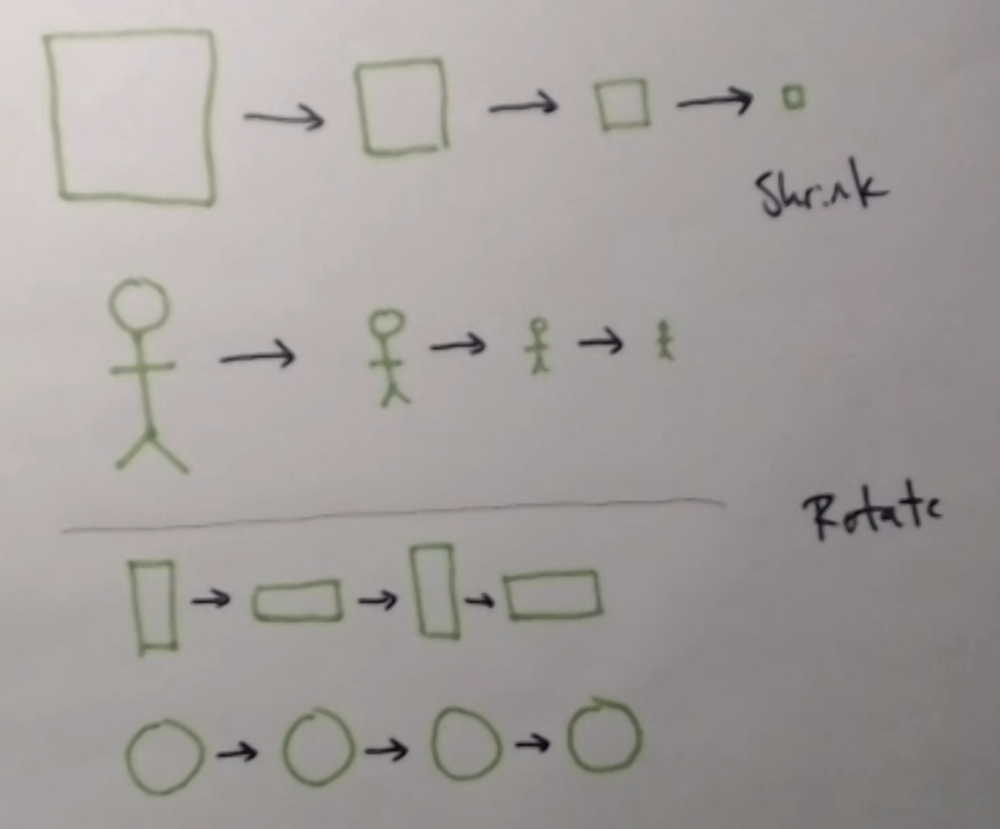

```{r setup, include=FALSE}
knitr::opts_chunk$set(echo = TRUE)
library(tidyverse)
```

## Today's goals

- Functions
- Iterations with numbers
- Iterations with shapes



## Functions

General functions reminder: You've likely come across functions a bunch in the past.
Functions are sets of instructions, rules expressed as an equation (formula). It is
a mathematical expression that takes in an input and returns an output. 

There are deterministic functions which always return the same output for a same input.
There are stochastic, or aleatory functions, which where the input does not define
(or at least does not completely define) the output: for the same input, the function
run multiple times may return different results. The nature and distribution of these 
results will depend on the properties of the function.



```{r}
function_example <- function(x){
  return(3 * x + 6)
}
```

Fixed points are values which, when inputted into a given function remain unchanged.

In algebraic notation, a fixed point equation is when $f(x) = x$

You can find a fixed point for a function by solving the function's fixed point equation.
For example, for the function $f(x) = 3x+6$:

$f(x) = 3x+6 = x$

$x = 3x+6$

$3x+6-x = 0$

$2x+6 = 0$

$2x = -6$

$x = -3$

Ta-dah! We just found a fixed point of the function at $x = -3$!

**Function examples**



## Iteration

Iteration describes a process where you repeatedly apply a function, starting from 
an initial value known as the **initial condition**, or **seed**.

The sequence of values from $x_0 \rightarrow x_1 \rightarrow x_2 \rightarrow ... \rightarrow x_n$ 
is known as the **trajectory**, **itinerary**, or **orbit** of a function for a given
value of the initial condition $x_0$.



**Iteration examples:**



```{r}
# in code, you can iterate a function manually, or in a loop, or you can have the loop
# be part of the function, causing it to run every time the function is called: this
# type of function is called an iterative function

iterative_function_example <- function(x_0, N){
  x_n <- x_0
  itinerary <- c()
  for(i in 1:N){
    itinerary <- c(itinerary, x_n / 2 + 2)
    x_n <- x_n / 2 + 2
  }
  return(data.frame(itinerary = itinerary))
}

x_0 <- 1
N <- 10
iterative_function_example(x_0, N) # requests an itinerary of N iterations of a function for an initial condition x_0

# let's plot the resulting trajectory
iterative_function_example(x_0, N) %>% 
  ggplot(aes(x = 1:N, y = itinerary)) + 
  geom_line() +
  labs(x = "x_t", y = "f(x)")

```

In the example above, we can see that whatever our initial condition, it seems that
over a number of iterations, the values we get converge to $4$.

Here, $4$ also happens to be a fixed point of the function ($f(x) = \frac{1}{2}x+2$)

Because the iteration process "attracts values to the fixed point $4$ over $N$ 
iterations", we call $4$ a fixed-point attractor of the function.

We will see in this course that there are other types of attractors.

**Important questions to keep in mind:**

- How can we know if there is only one of multiple point attractors for a function 
given different initial conditions?
- How can we know how many fixed-point attractors/other types of attractors there are?
- How can we know the nature of these attractors?
- How can we know how attracting/repelling points are in a function? How can we know 
the range of the attraction of an attractor?

These are all cool questions, but we will have to wait a little bit before we get 
to them. We will see them in later classes.

## Iterations with shapes

Rotation of a square around its centre is a fixed point. 90 degree rotations will always 
return the same shape in the same configuration.

Rotation of $90^{\circ}$ = cycle of period 2 when rotating a rectangle around its centre.

