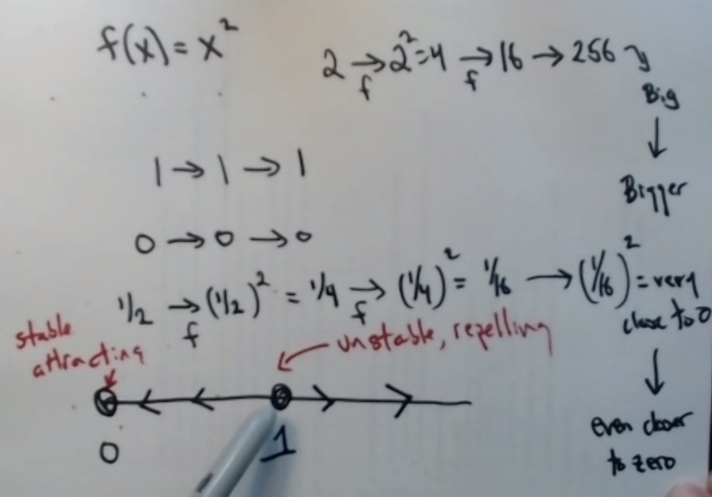

```{r setup, include=FALSE}
knitr::opts_chunk$set(echo = TRUE)
library(tidyverse)
```

## Today's goals

- More iteration, stability
- Time series graphs


## Definitions from last time

 

## More iteration:

A **phase line** shows the behaviour of a function around fixed points. See the top 
of the picture below:


At the bottom of the last picture, we plot the outputs of the function for each 
time step, such that the y axis is the value returned by the function, and the x 
axis is the time step. This is called a **time series plot**.

Notice that if you take the phase line and put it along the y axis of the time series
plot, it summarises the bahaviour of the function around its fixed points:


The behaviour of a function arount a fixed point can vary. Typically, a fixed point 
can either be attractive (**stable**) or repelling (**unstable**). 



**Questions for next time:** 

- Can a fixed point be a mix of attractive and repelling?
- Can two adjacent fixed points both be repelling at the same time? What happens 
in the space between them then?

Let's play around with a few functions.

Function 1:

```{r}
# in code, you can iterate a function manually, or in a loop, or you can have the loop
# be part of the function, causing it to run every time the function is called: this
# type of function is called an iterative function

iterative_function_example <- function(x_0, N){
  x_n <- x_0
  itinerary <- c()
  for(i in 1:N){
    itinerary <- c(itinerary, 2 * x_n - 6)
    x_n <- 2 * x_n - 6 
  }
  return(data.frame(itinerary = itinerary))
}

x_0 <- 4
N <- 4
iterative_function_example(x_0, N) # requests an itinerary of N iterations of a function for an initial condition x_0

iterative_function_example(x_0, N) %>% 
  ggplot(aes(x = 1:N, y = itinerary)) + 
  geom_line() +
  labs(x = "x_t", y = "f(x)")
```
Phase line:
$\leftarrow 6 \rightarrow$ 

Function 2:

```{r}
iterative_function_example <- function(x_0, N){
  x_n <- x_0
  itinerary <- c()
  for(i in 1:N){
    itinerary <- c(itinerary, x_n ^2)
    x_n <- x_n ^2
  }
  return(data.frame(itinerary = itinerary))
}

x_0 <- 0.3
N <- 10
iterative_function_example(x_0, N) 

iterative_function_example(x_0, N) %>% 
  ggplot(aes(x = 1:N, y = itinerary)) + 
  geom_line() +
  labs(x = "x_t", y = "f(x)")
```

$\rightarrow 0 \leftarrow 1 \rightarrow$

This function contains two fixed points. 1 **stable** (attracting), and one **unstable** (repelling).

Stable: rock in the bottom of a valley
Unstable: rock at the top of a hill


