```{r setup, include=FALSE}
knitr::opts_chunk$set(echo = TRUE)
library(tidyverse)
```

**Questions to ask today:**

- Can a fixed point be a mix of attractive and repelling?
- Can two adjacent fixed points both be repelling at the same time? What happens 
in the space between them then?

## Today's goals

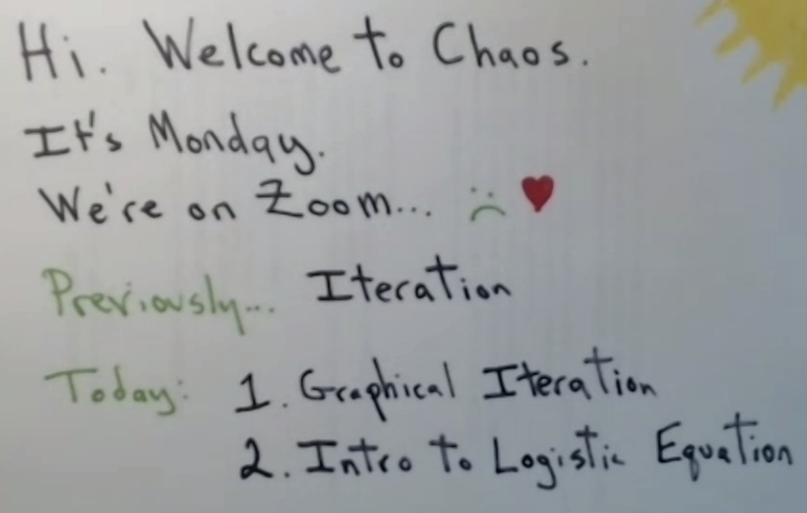
## Finding Fixed points of a function:

You can find fixed points of a function by plotting the function against the function
$f(x) = x$. This seems obvious, but it's a neat trick to quickly visualise where a 
function's fixed points are.

In the exaple below, you, can see that the intersections of the two functions show 
the fixed points of the function $f(x) = -1 \cdot sin(x) + x$.

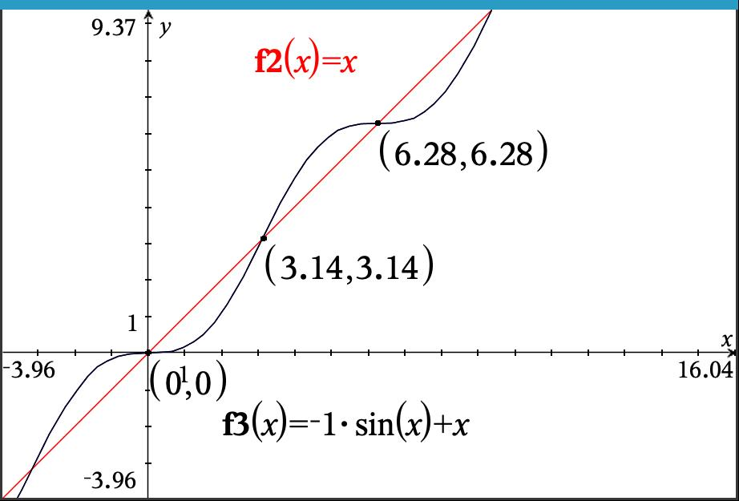

We can confirm these fixed points by running this function for the suggested fixed 
point values on a calculator.

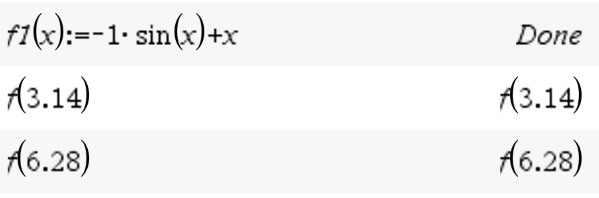

## Graphical iteration

[Explanation of graphical iteration](http://www-m8scheurle.ma.tum.de/personen/hayes/chaos/Iteration.html#:~:text=Graphical%20iteration%20is%20a%20method,the%20iteration%20of%20a%20function.&text=%3D2%20converges%20to%20the%20fixed,the%20function%20and%20the%20diagonal.&text=The%20next%20graph%20offers%20an%20alternative%20view%20of%20the%20problem.)

Graphical iteration is a type of function iteration which allows us to trace trajectories
of iterations through functions visually.

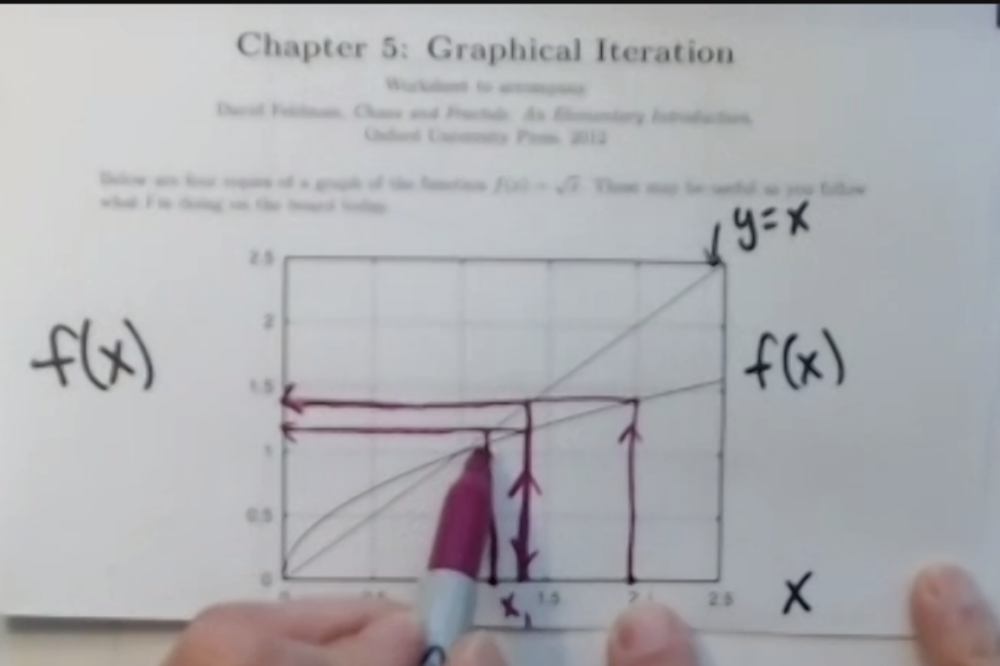
Here's a cleaner version of the image above to give you a better idea of what's 
going on:

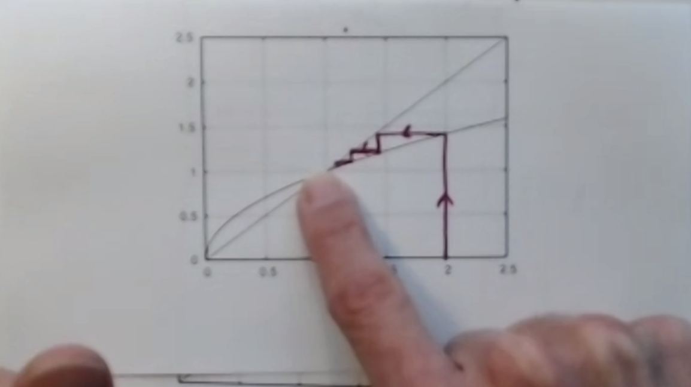

You can see that our graphical iteration represents a trajectory towards the function's
fixed point, indicating its nature as a stable fixed point. 

We can trace trajectories from different initial conditions to see how varying initial 
conditions will affect the function's behaviour.

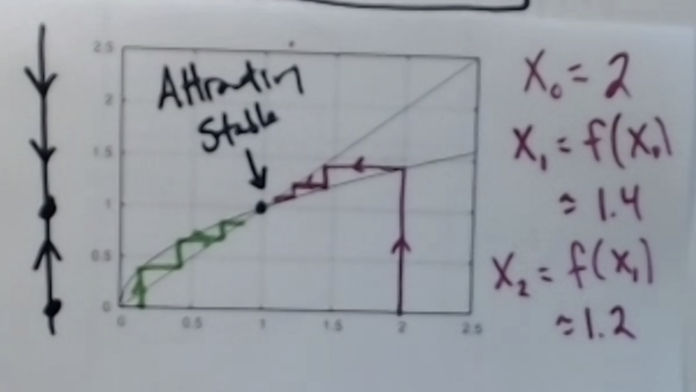

Let's trace a few trajectories on different function 2d plots and see what we can 
discover.

This next function has two fixed points. The fixed point $0$ is stable, while the 
other fixed point is unstable.

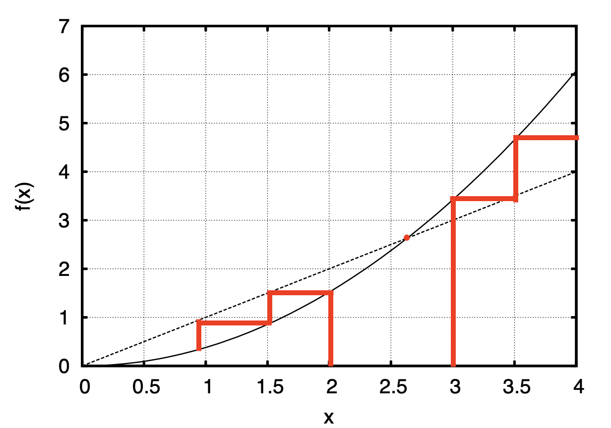
This next one has no fixed point, and tend towards infinity:

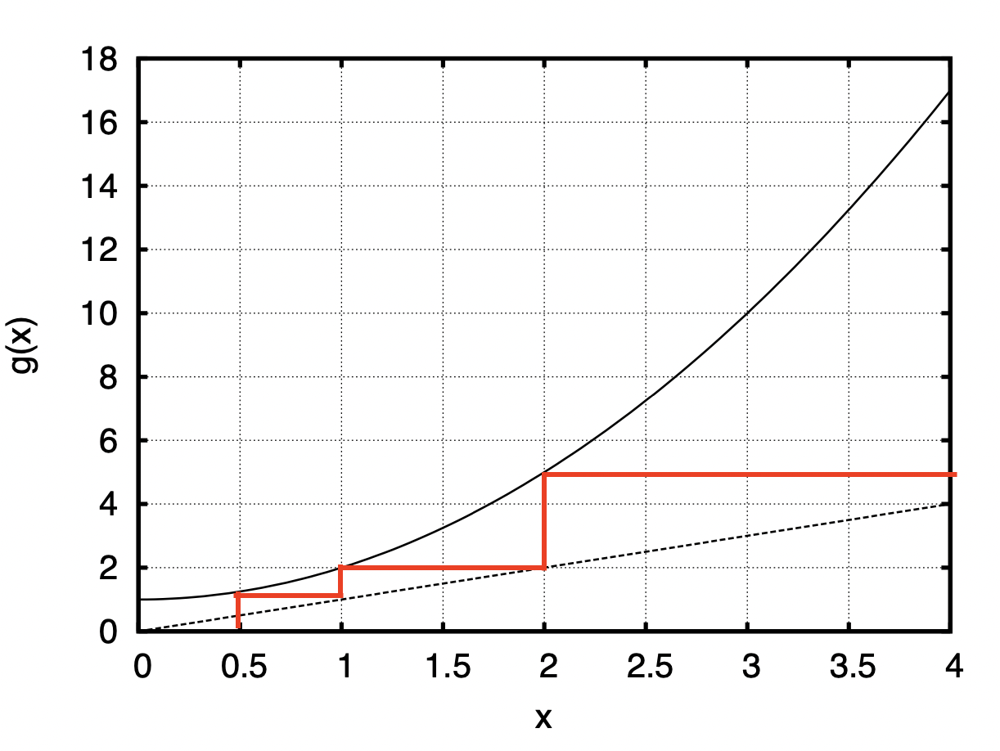
Okay, one more! This next one is interesting: for some initial conditions, the trajectory
oscillates between values. In other words, the trajectory loops!

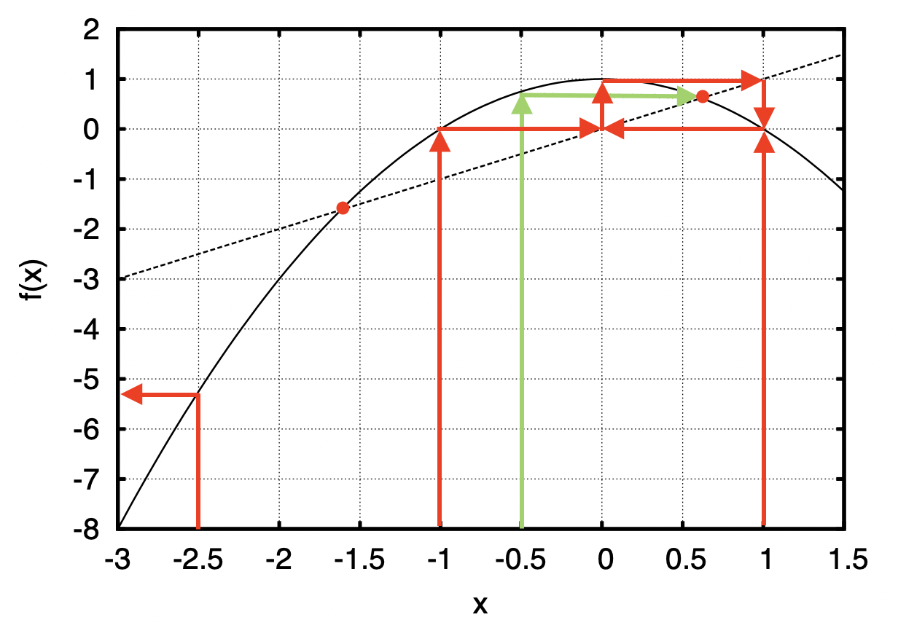
Here's Dave's rendition: 

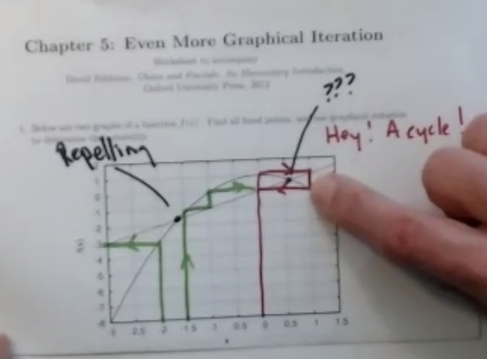
On further inspection, the function has another interesting property: for any initial
condition inside the upper and lower boundaries of the loop, the trajectory spirals 
outwards, approaching the loop's values:

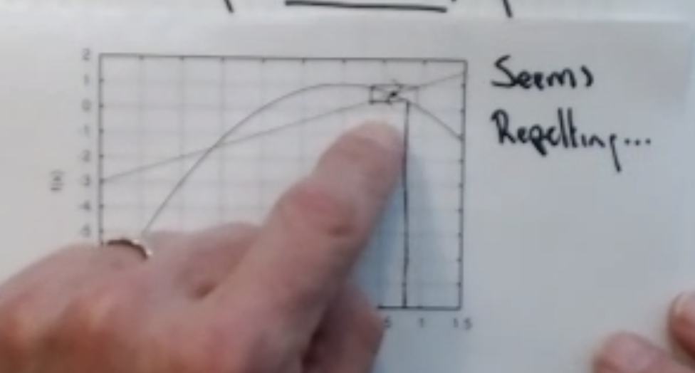

It seems like the fixed point is unstable, repelling towards the loop. But this 
behaviour is new, so is it an unstable fixed point? What does this behaviour suggest?
These are questions we'll explore in the next few classes.

## Graphical iterator program

I've written a simple graphical iterator program to help make graphical iterations
on the fly. Here it is:

```{r}
# declare your function here:
func <- function(x){
  return(x ^ 2) # function
}

get_function_data <- function(range = c(-1, 1), steps = 100){
  x <- seq(from = range[1], to = range[2], length.out = steps)
  
  y <- array(dim = steps) 
  for(i in 1:length(x)){
    y[i] <- func(x[i])
    } 
  
  return(data.frame(x = x, y = y))
}

graphical_iterator <- function(x_0, N = 100){ 
  
  start <- x_0 
  vert <- FALSE 
  
  xstarts <- c(start)
  ystarts <- c(0)
  xends <- c(start)
  yends <- c(func(start)) 
  
  # iteratively get the coordinates of the next segment points
  for(i in 1:(2 * N)) 
  # range = 2 * N because every step will be described by two segments
  {
    # if the last segment was vertical, the next must be horizontal, and vice versa
    if(vert){
      xstarts <- c(xstarts, start)
      ystarts <- c(ystarts, start)
      xends <- c(xends, start)
      yends <- c(yends, func(start)) 
      vert <- FALSE
    }
    else{
      xstarts <- c(xstarts, start)
      ystarts <- c(ystarts, func(start)) 
      xends <- c(xends, func(start)) 
      yends <- c(yends, func(start)) 
      vert <- TRUE
      start <- func(start) # update start value
    }
  }
  return(data.frame(xstarts, ystarts, xends, yends))
}

plot_data <- get_function_data(range = c(0,1))
cobweb_traject <- graphical_iterator(x_0 = 0.8, N = 100)

plot_data %>% 
  ggplot(aes(x, y)) +
  geom_line() +
  geom_abline() + 
  geom_segment(data = cobweb_traject, aes(x = xstarts, y = ystarts, 
                                          xend = xends, yend = yends))
```

## The logistic equation

$f(x) = rx(1-x)$

$r$ is a parameter of the logistic equation.

Let's iterate it a bit.

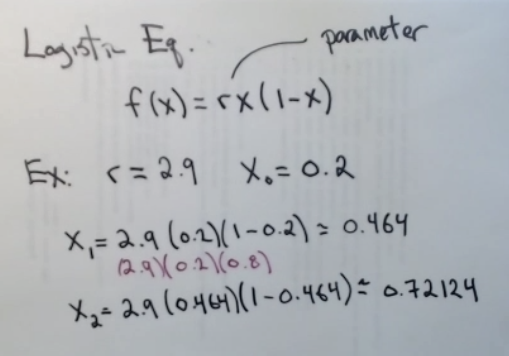