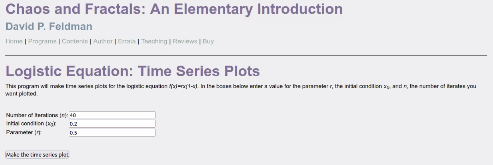
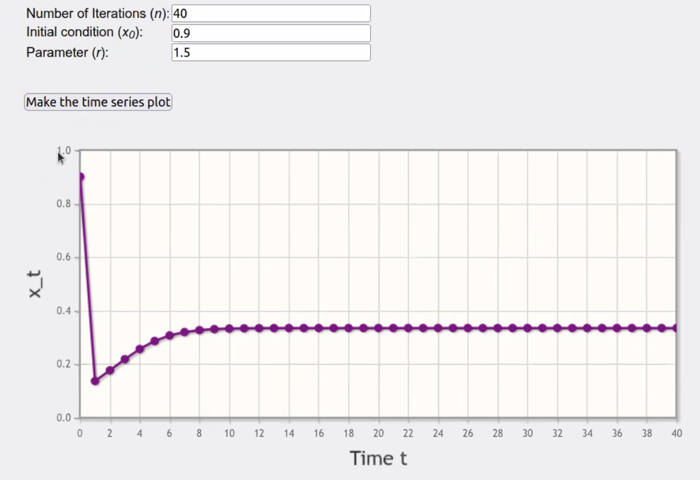
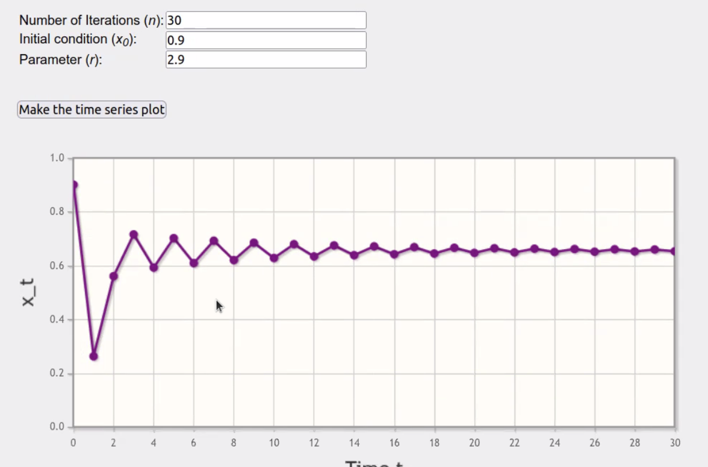
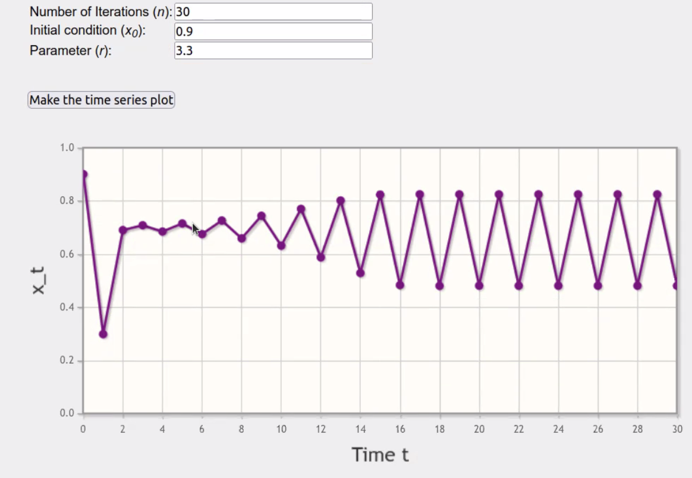
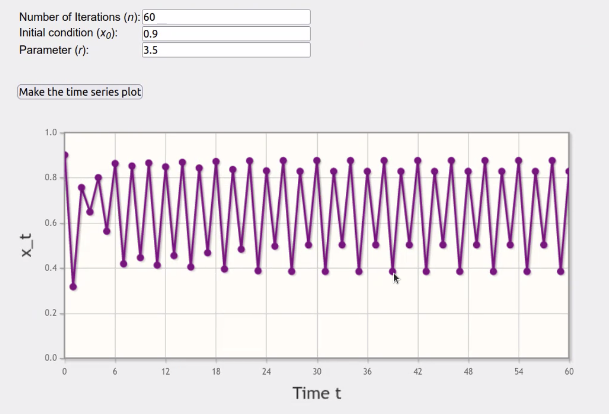
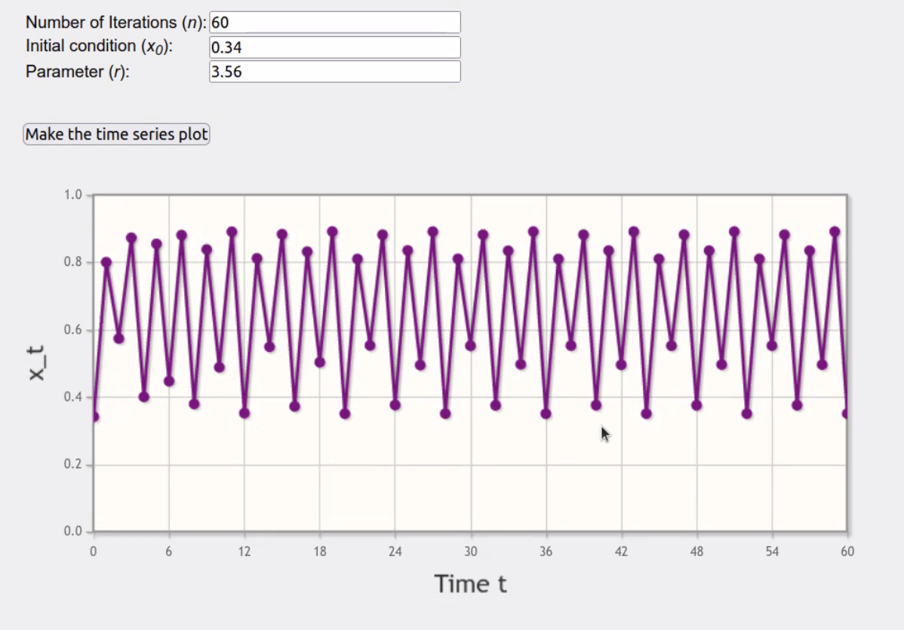
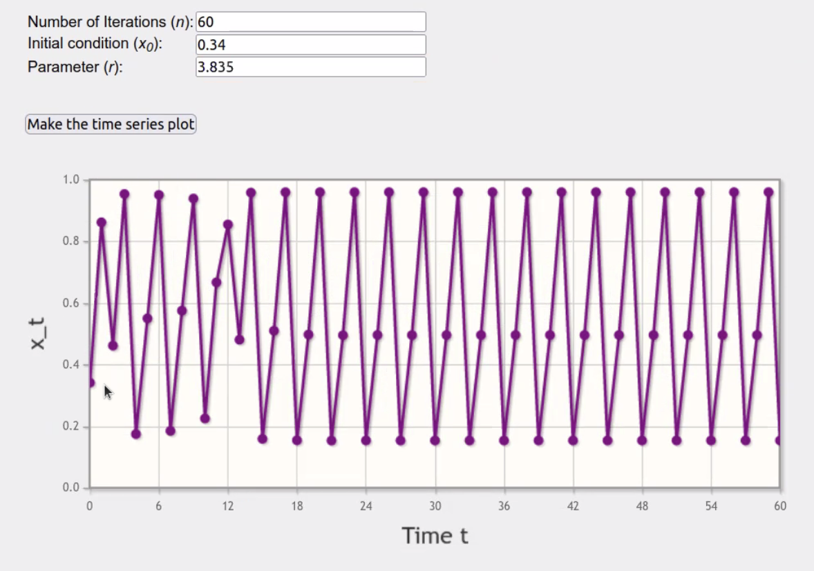
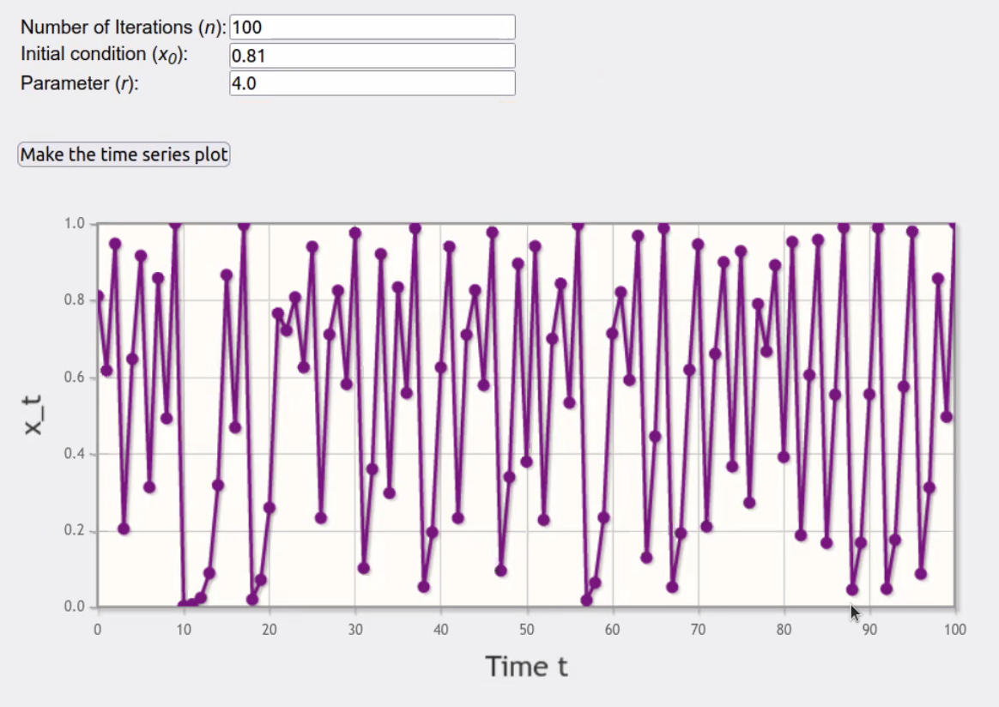
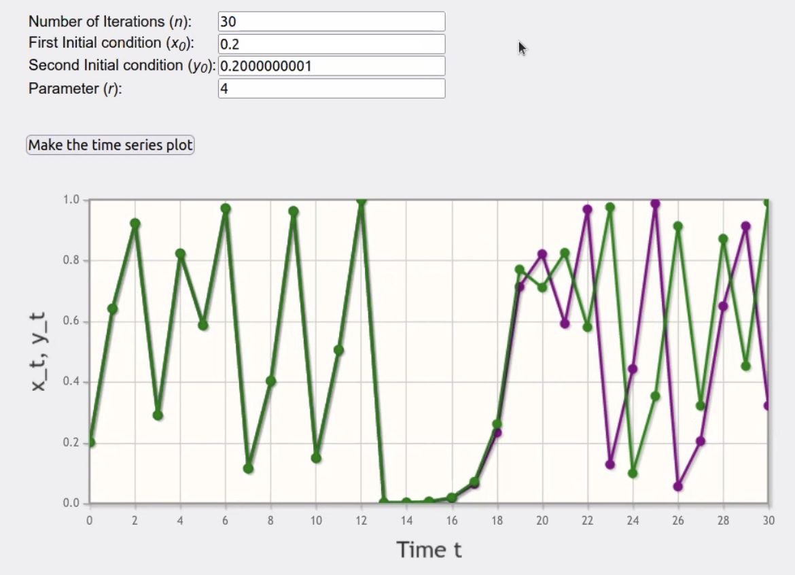

```{r setup, include=FALSE}
knitr::opts_chunk$set(echo = TRUE)
library(tidyverse)
```

## Today's goals


## Trajectory types on the logistic map

For $0 \leq r \leq 1$: The trajectory approaches $0$




For $1 < r < 3$: The trajectory approaches a fixed point.




For $3 \leq r < 4$: Things get weird.

For a range of values of $r$, the trajectory enters a periodic behaviour of period 2.



For higher values of $r$ the period of the cycle doubles, resulting in period 4.
Then for even higher values, it doubles again, and then again for even higher values!




Then, for high enough values of $r$ the period stops settling, and we get aperiodic behaviour. But within this aperiodic streak, some values of $r$ will return periodic trajectories.



Finally, for $r = 4$, we get an aperiodic trajectory. 



## Sensitive dependence on initial conditions

Notice that in aperiodic trajectories, a very slight variation in $r$ will result in a completely different trajectory somewhere down the line. This is known as the butterfly effect, or sensitive dependence on initial conditions. 

