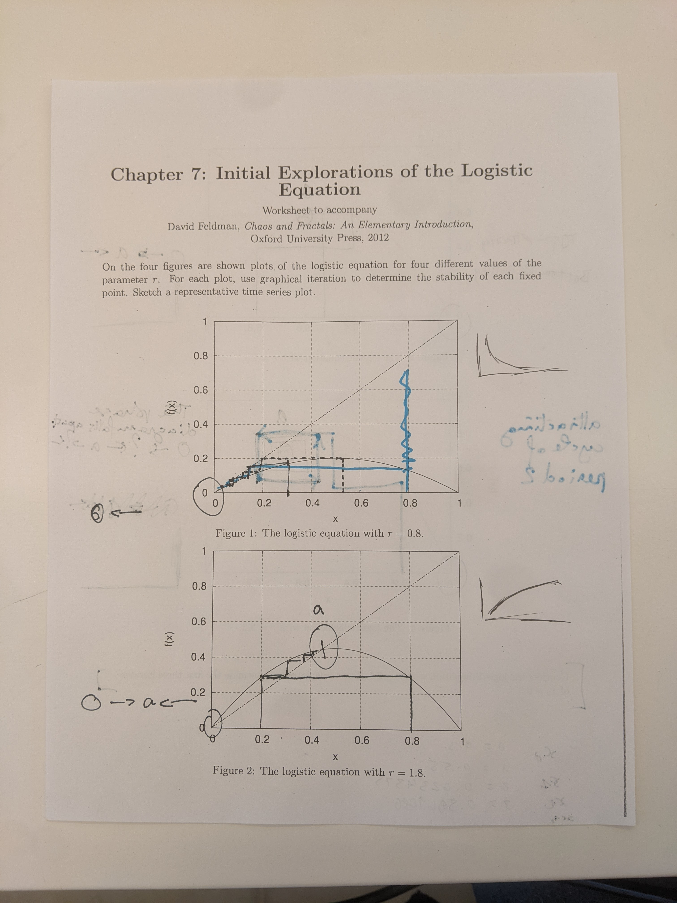

```{r setup, include=FALSE}
knitr::opts_chunk$set(echo = TRUE)
library(tidyverse)
```

## Today's goals

- Logistic Equation
- Derivation
- Graphical iteration practice
- Bifurcation diagram

## Logistic equation

Logistic equation: $f(x) rx(1-x)$ where$r$ is the growth rate, and $x$ is a fraction of the maximum population.

The logistic equation is used a lot in population ecology to model population variation through time.

There is a continuous variation of this equation (look this up).


## Graphical iteration practice




## Bifurcation diagram

How might we represent the long term fate of the itinerary for an initial condition?

Let's imagine a plot with the parameter $r$ as the x axis, and the long term fate of the itinerary of the logistic map as the y axis. What would this look like?

```{r}
# Solution provided by Edmund Hart at https://rpubs.com/DistribEcology/880 based on the work of Corey Chivers at https://bayesianbiologist.com/2012/07/13/dynamical-systems-mapping-chaos-with-r/

library(ggplot2)
rmax <- 30
out.df <- matrix(NA, ncol = 2, nrow = 0)
a <- 0.01
r <- seq(0, rmax, by = 0.01)
n <- 100

for (z in 1:length(r)) {

    xl <- vector()
    xl[1] <- 10
    for (i in 2:n) {

        xl[i] <- xl[i - 1] * r[z] * exp(-a * xl[i - 1])

    }
    uval <- unique(xl[40:n])
    ### Here is where we can save the output for ggplot
    out.df <- rbind(out.df, cbind(rep(r[z], length(uval)), uval))
}
out.df <- as.data.frame(out.df)
colnames(out.df) <- c("r", "N")
ggplot(out.df, aes(x = r, y = N)) + geom_point(size = 0.001)
```

Wowzers!!!! That's so cool!