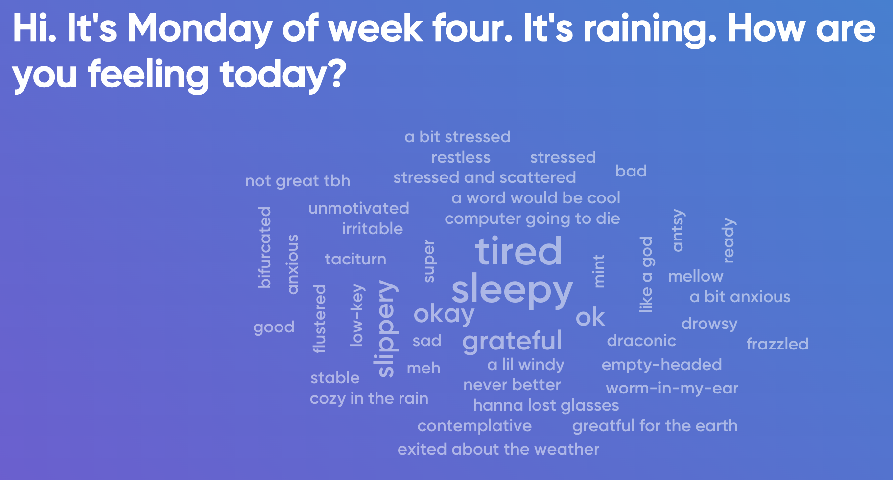
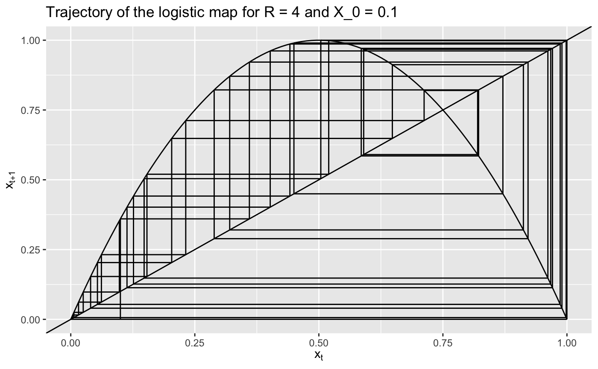
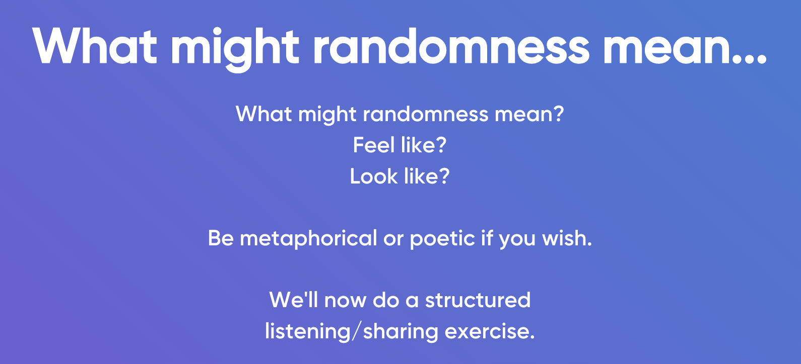
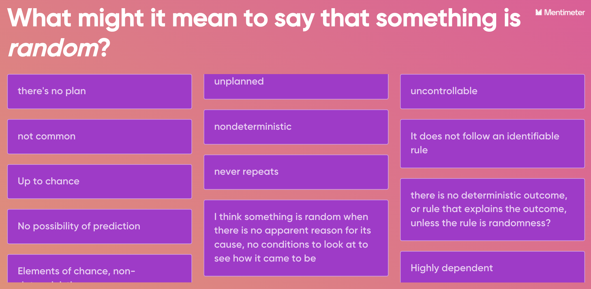
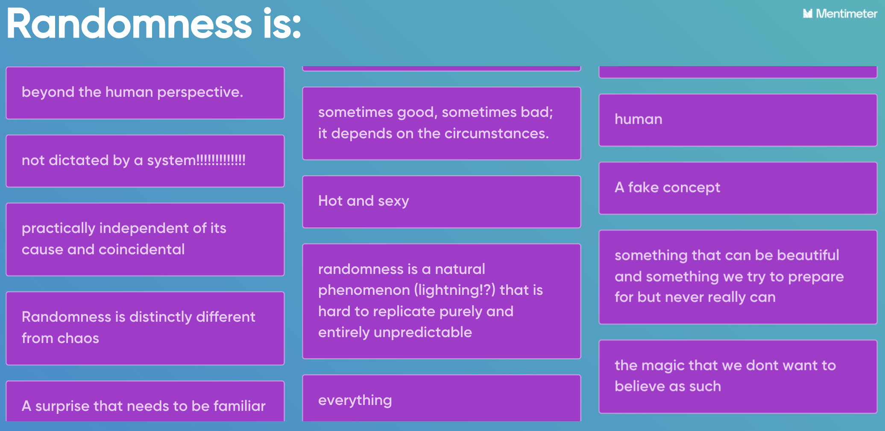
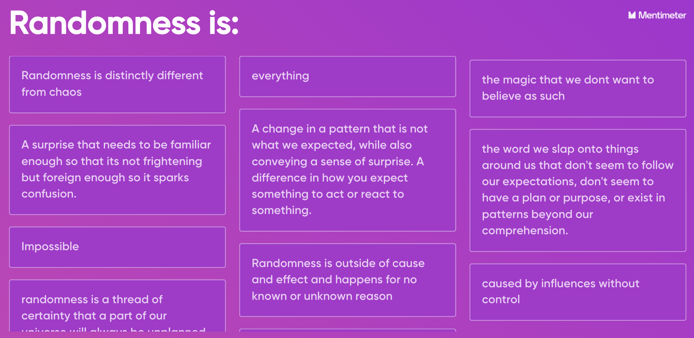
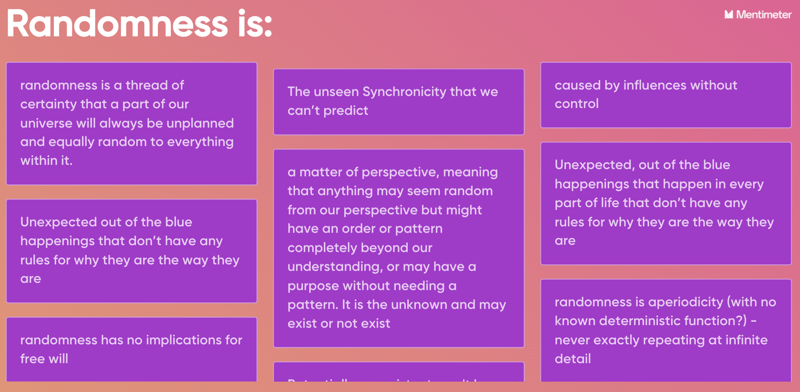

```{r setup, include=FALSE}
knitr::opts_chunk$set(echo = TRUE)
library(tidyverse)
```



## Today's goals

- Definition of Chaos
- Definition and exploration of randomness

```{r}

```

## Definition of Chaos

A dynamical system is **chaotic** if...

1. It's deterministic
2. Orbits are bounded (they don't run off to infinity)
3. Orbits are aperiodic (they never repeat)
4. Orbits have sensitive dependence on initial conditions (butterfly effect, small changes are magnified along the orbit)
  a. Sensitive dependence on initial conditions is caused by a kneading motion: see [Smale Horseshoes](https://en.wikipedia.org/wiki/Horseshoe_map)
    i. Due to stretching points apart
    ii. Due to folding points back onto themselves

Chaos is a property of a dynamical system. A dynamical system is a system which exhibits changes through time according to rules.

Example chaotic orbit:



## What is randomness?

**Brainstorming part:**

- Aperiodicity with no determinism, or no known deterministic describing function.
- Maybe it's just aperiodicity? Does it matter if there is or isn't a predicting function?












**Mathematical definition:**

- A system is random if it has no patterns. It is random if it cannot be compressed.
- **Randomness = no patterns and cannot be compressed.**

Note: If you know a deterministic function to predict randomness, and you know the initial condition with infinite detail, then you know a way of compressing the orbit of the function.

The statistics of randomness generated by the deterministic random orbits on the logistic map are as random as truly 'nondeterministic' random numbers.

Deterministic randomness is when you have a deterministic function to produce the random output.
Stochastic randomness is when the randomness is produced in a process that involves chance.