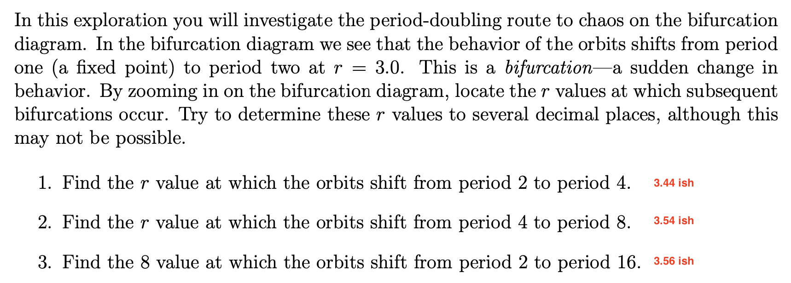
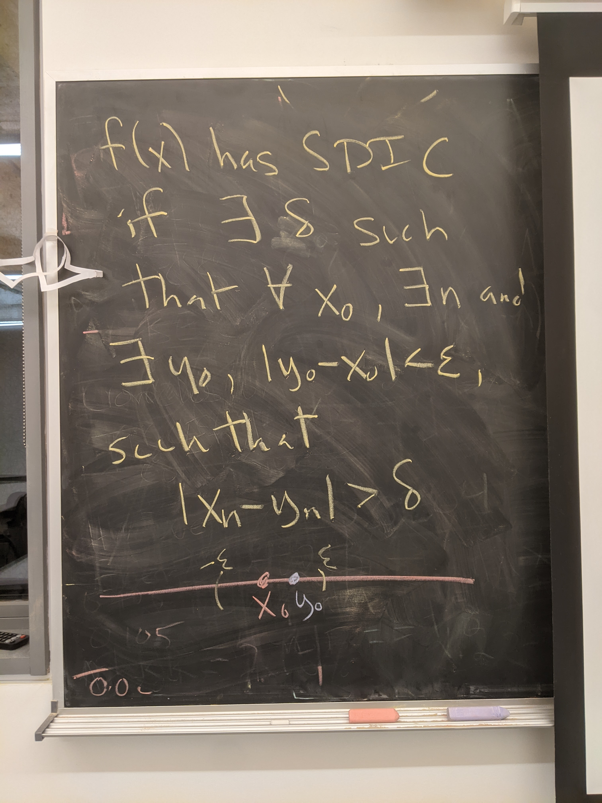

```{r setup, include=FALSE}
knitr::opts_chunk$set(echo = TRUE)
library(tidyverse)
```

## Questions to ask

- ask about symbols in optional homework

## Today's goals

- linear and nonlinear
- universality

## Linear vs nonlinear

Linear functions: The whole is the sum of the parts. $f(a+b) = f(a) + f(b)$ and whose y intercept = 0.
Nonlinear functions: The whole is not the sum of the parts. $f(a+b) \neq f(a) + f(b)$

"In mathematics, the term linear function refers to two distinct but related notions: In calculus and related areas, a linear function is a function whose graph is a straight line, that is, a polynomial function of degree zero or one. For distinguishing such a linear function from the other concept, the term affine function is often used.
In linear algebra, mathematical analysis, and functional analysis, a linear function is a linear map.

In mathematics and science, a nonlinear system is a system in which the change of the output is not proportional to the change of the input." - Wikipedia, linear functions, and nonlinear systems.

## Bifurcactions of the bifircation diagram



1. 3.0
1. 3.445
2. 3.544
3. 3.564

We see these pitchfork bifurcations in the bifurcation diagram of the logistic map, but how long are these bifurcations?

```{r}
approximate_bifurcation_points <- c(3.0, 3.445, 3.544, 3.564)
next_bifurcation_minus_last_bifurcation_point <- approximate_bifurcation_points[2:4] - approximate_bifurcation_points[1:3]
ratios_beteen_distances <- next_bifurcation_minus_last_bifurcation_point[1:2] / next_bifurcation_minus_last_bifurcation_point[2:3]
ratios_beteen_distances
```

If we had very precise measurements, and made the same calculations over and over again throughout the bifurcation diagram's bifurcation points, the ratios would approach a constant: $4.669$. This constant is known as Feigenbaum's constant.

Feigenbaum's constant: $4.669$: the distance between a bifurcation and the next divided by the distance from the second bifurcation to the next bifucation.

```{r}
# Solution provided by Edmund Hart at https://rpubs.com/DistribEcology/880 based on the work of Corey Chivers at https://bayesianbiologist.com/2012/07/13/dynamical-systems-mapping-chaos-with-r/

rmax <- 30
out.df <- matrix(NA, ncol = 2, nrow = 0)
a <- 0.01
r <- seq(0, rmax, by = 0.01)
n <- 100

for (z in 1:length(r)) {

    xl <- vector()
    xl[1] <- 10
    for (i in 2:n) {

        xl[i] <- xl[i - 1] * r[z] * exp(-a * xl[i - 1])

    }
    uval <- unique(xl[40:n])
    ### Here is where we can save the output for ggplot
    out.df <- rbind(out.df, cbind(rep(r[z], length(uval)), uval))
}
out.df <- as.data.frame(out.df)
colnames(out.df) <- c("r", "N")
ggplot(out.df, aes(x = r, y = N)) + geom_point(size = 0.001)
```

The period doubling also occurs for other formulas, for example, the cubic map, and in functions where these bifurcations occur, the ratios between distances between bifurcations (Feigenbaum's constant) is always the same. This is known as **universality**.

## Mathematical definition for sensitive dependence on initial conditions (SDIC)

