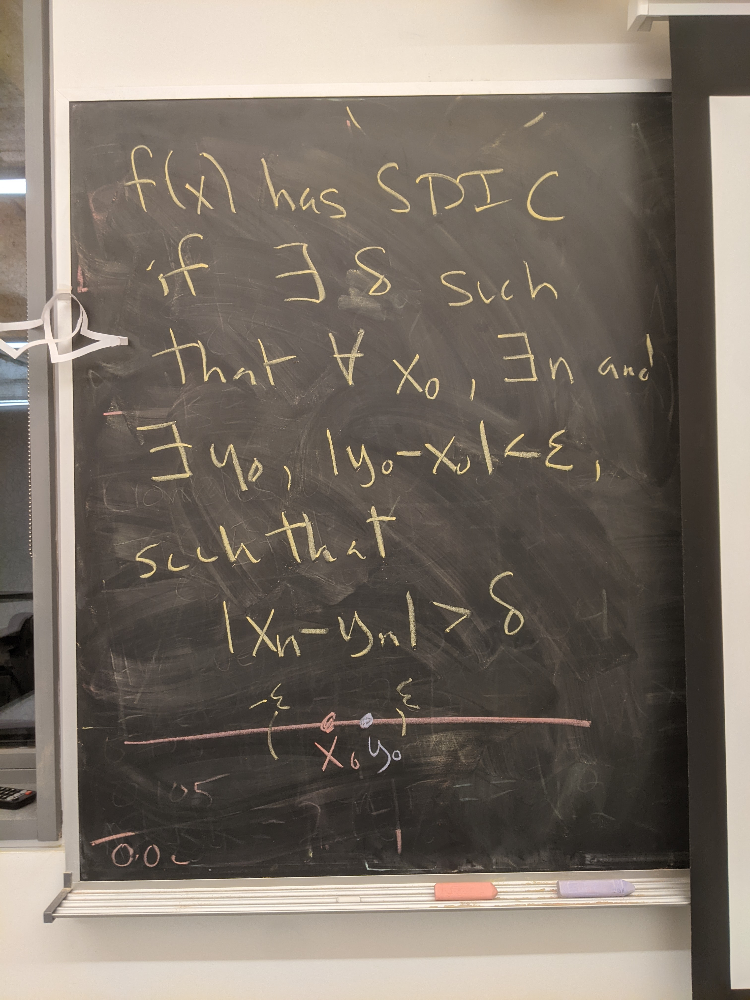

```{r setup, include=FALSE}
knitr::opts_chunk$set(echo = TRUE)
library(tidyverse)
```

## Questions to ask today

- How do I translate the logistic function's discrete form into the continuous form?

## Today's goals

- intros
- logistic exercise
- chaos terms and concepts

## Histograms


If we look at the histograms of the orbits of the logistic map at different initial conditions, the histograms of the orbit values look similar. For one, the distributions of values seem skewed towards values close to 0 or close to 1.

The orbits are unstable at r=4, but they are statistically stable. Their distributions are predictable.

- There are no gaps in the distributions
- The distribution is skewed towards the tails


Think of weather and climate as an analogy: Weather is unstable and unpredictable, but climate is statistically stable, and thus is much more predictable (this is an imperfect analogy, there are cases in which the reverse is true, or neither or both systems are stable, depending on what you are looking at).

We can say that there is local instability coupled with global stability.

From Dave's book: "The histogram of the orbit for the logistic map at r = 4.0 appears smooth. You may wonder if it is possible to find a function that approximates this smooth curve. The answer is “yes”. One can prove that the curve for the histogram is given by $\frac{1}{\pi\sqrt{x(1-x)}}$."

```{r}
# let's do this in R
r <- 4
x_0s <- c(0.2, 0.4) # seq(0, 1, length=5) results in something weird
N <- 10000

bins <- 100
orbit_preview_length <- 30

# function declaration
func <- function(x){
  return(r*x*(1-x)) 
}

get_function_iteration_trajectories <- function(x_0s, N = 100){
  trajectories <- data.frame()
  
  for(i in x_0s){
    x_t <- i
    x_0 <- rep(i,times=N+1)
    n <- 0:N
    
    trajectory <- c(x_t)
    
    for(t in 0:(N-1)){
      x_t <- func(x_t)
      trajectory <- c(trajectory, x_t) # add x_t_1's value to the trajectory vector
    }
    trajectories <- rbind(trajectories, data.frame(x_0s = x_0, n = n, x_n = trajectory))
  }
  return(trajectories)
}

trajectories <- get_function_iteration_trajectories(x_0s = x_0s, N = N)

trajectories %>% ggplot(aes(x_n, y=..density..)) + 
  geom_histogram(aes(fill=as.factor(x_0s)), position="dodge", bins=bins) +
  labs(title = paste("Histograms of orbit values"))

trajectories$x_0s <- paste("x", trajectories$x_0s)
trajectories %>% pivot_wider(names_from = x_0s, values_from = x_n) %>% 
  filter(n <= orbit_preview_length) %>% 
  pivot_longer(-n, names_to = "x_0s", values_to = "x_n") %>% 
  ggplot(aes(n, x_n, colour = as.factor(x_0s))) + 
  geom_point() + geom_line() +
  labs(title = paste("Orbits preview up to n = ", orbit_preview_length))
```

The logistic equation has the following properties:

**Ergodicity:** In mathematics, ergodicity expresses the idea that a point of a moving system, either a dynamical system or a stochastic process, will eventually visit all parts of the space that the system moves in, in a uniform and random sense.

If COA is an ergodic system, you can get the same information about the school by asking everyone in the school what their interests are, and following one person around for a while as their interests evolve.


**Sensitive dependence on initial conditions:** 




**Mixing:**

A dynamical system is mixing if, within any small neighbourhood of initial conditions, there are points that eventually visit any other small neighbourhood.


## Deterministic, Stochastic, Random

- A system is **deterministic** if it follows a well defined, unambiguous rule. The same input always gives the same output. If a system is deterministic, the itinerary is completely determined by knowledge of the rule and the exact initial condition.
- A system is **stochastic** if there is an element of chance involved. The same input does not always yield the same output.
- A sequence is **random** if it is incompressible. A random sequence has no regularities or patterns.
- **Chaos** is randomness produced by a deterministic dynamic system.
