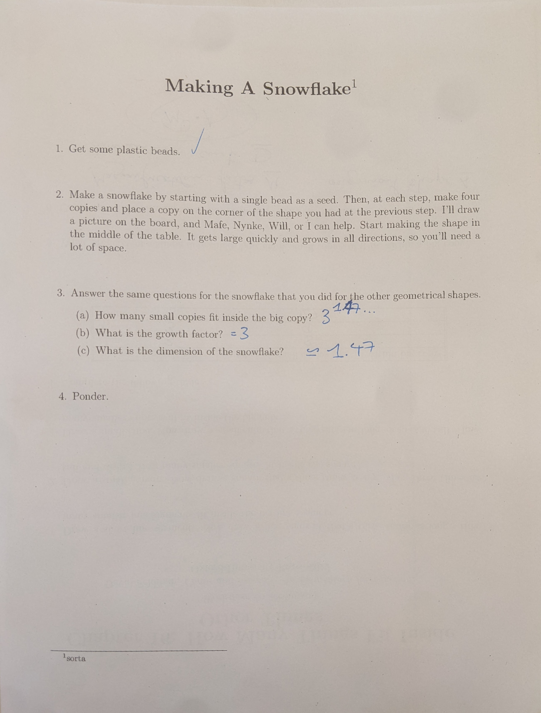

```{r setup, include=FALSE}
knitr::opts_chunk$set(echo = TRUE)
library(tidyverse)
```

## Questions to ask today

- How do I translate the logistic function's discrete form into the continuous form?

## Today's goals

- Fractals and fractal dimension





