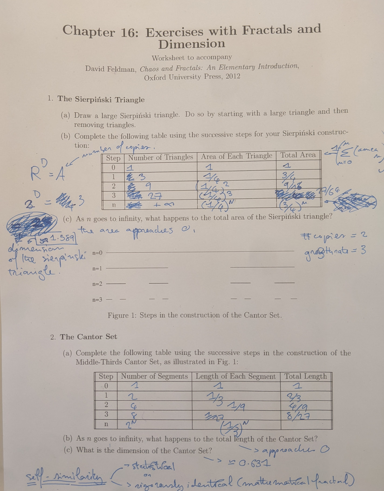
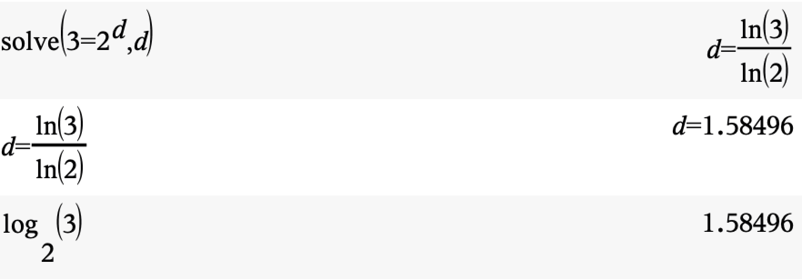

```{r setup, include=FALSE}
knitr::opts_chunk$set(echo = TRUE)
library(tidyverse)
```

## Today's goals

- More with fractals + dimensions
- Random Koch Curve
- Cantor Set Addresses 

## For Tuesday: 

- Reading
- Bring scissors + ruler

## For Thursday

- Fractal show and tell (prepare a fractal of your choice)

## More with fractals + dimensions

From last time:

**The number of small copies # is equal to the growth factor R to the power of the dimension D.**

$\# = R^D$

## More with fractals and fractal dimension




