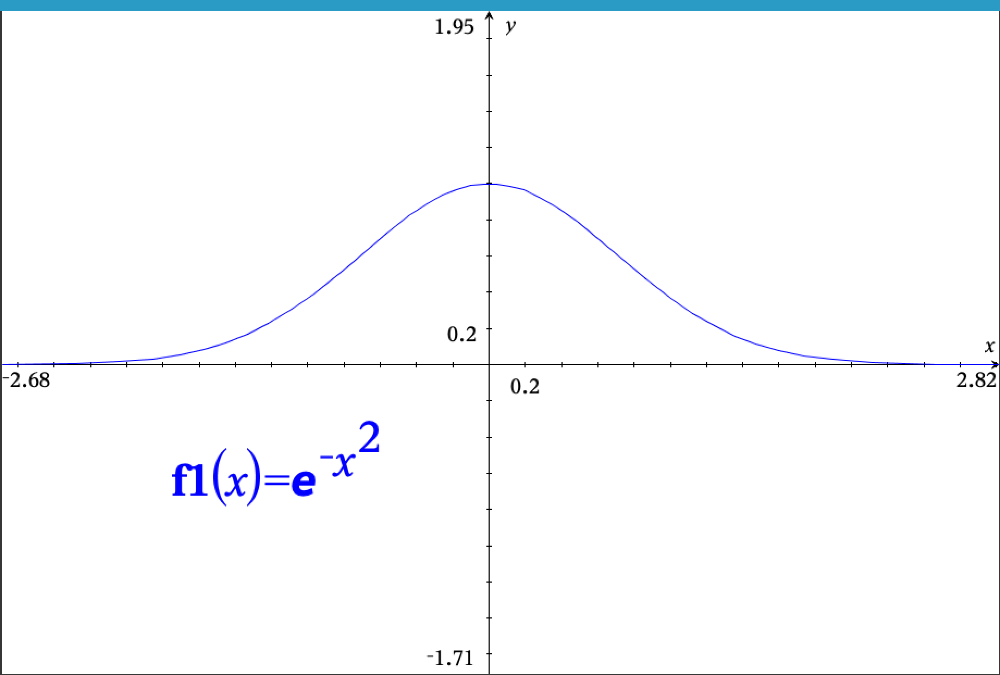

```{r setup, include=FALSE}
knitr::opts_chunk$set(echo = TRUE)
library(tidyverse)
```

## Today's goals

- Central limit theorem
- Power Laws
- More on Fractals

## Central limit theorem

A set of summed random variables with replacement from a non-normal distribution will approach a normal distribution.

Gaussian function: $f(x) = e^{-x^2}$




## Power laws

Word frequency distributions in languages, or in works in a given spoken language typically follow a power law (see the Pareto distribution).

Power laws exhibit rapid initial decay, but have long tails. 

Power law function: $f(x) = ax^{-k}$


Power laws are scale-free. They look the same at all scales. 

Imagine a coin toss game where you keep flipping the coin until you get tails. You win 2 dollars to the power of the number of times you got heads before getting tails every time you play. Suppose it costs 2 dollar to play, how much does playing this game win on average?

It turns out that there is no average winning rate for this game. The average keeps bumping around. Although the average might tend up towards infinity, it it not meaningful in any way for a player interested in getting an estimate of their earnings or losses before entering the game.

```{r}
set.seed(0)

N <- 10000 # number of desired samples (how many times do you play)
play_fee <- 2 # cost of playing

play <- function(){
  result <- ""
  count <- 0
  while(result != "T"){
    result <- sample(c("H", "T"), 1)
    count = count + 1
  }
  return(count)
}

counts <- c()
for(i in 1:N){
  counts <- c(counts, play())
}

play_fee <- rep(play_fee, N)
returns <- play_fee^counts

x <- 1:length(returns)
y <- cumsum(returns) / seq_along(returns)

tibble(x, y) %>%  ggplot(aes(x,y)) + geom_line() +
  labs(x="N games played", y="mean returns")

tibble(returns) %>% ggplot(aes(x=y)) + geom_density()
```

## Fractals

Fractals are objects that are self-similar at different scales. They are rough objects. They have a self-similarity dimension that is different than the topological dimension. 

