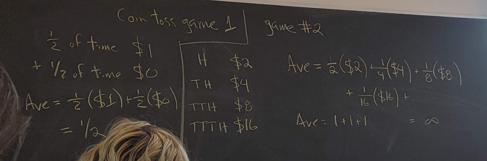
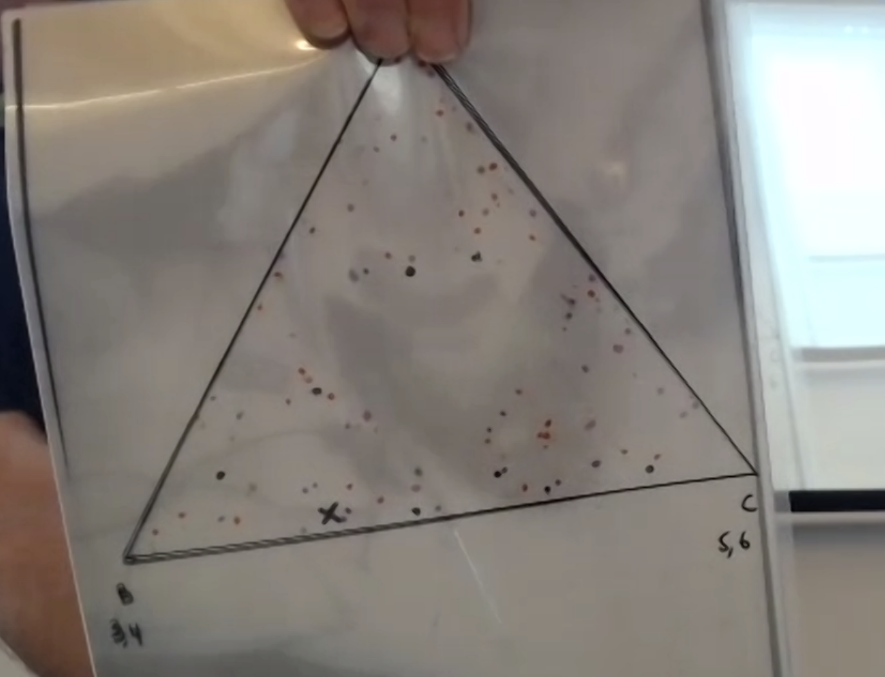
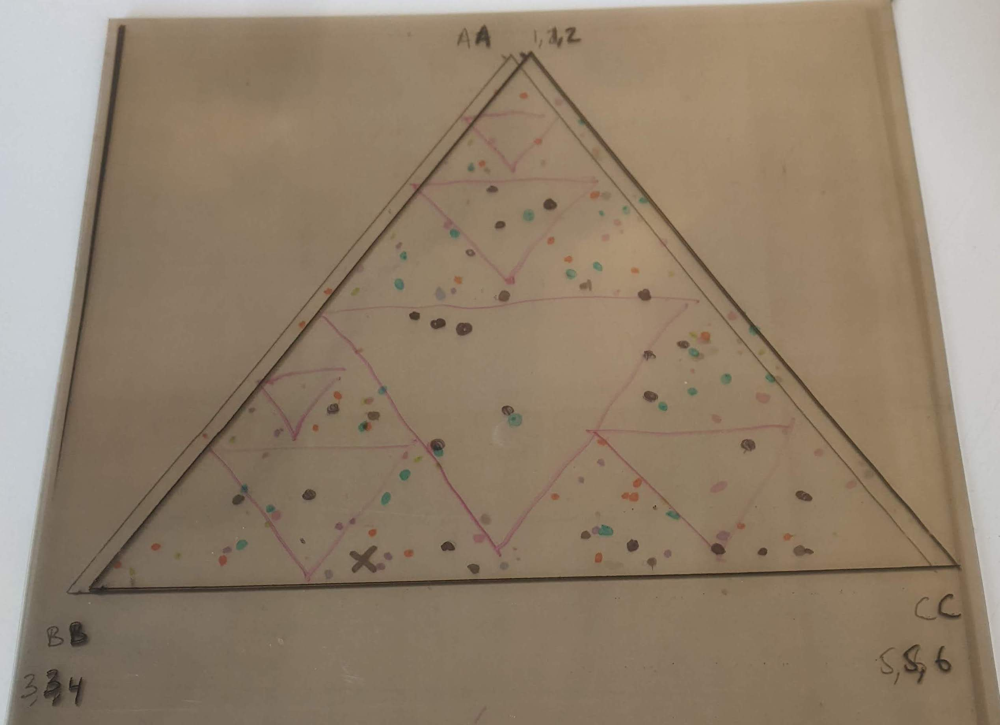

```{r setup, include=FALSE}
knitr::opts_chunk$set(echo = TRUE)
library(tidyverse)
```

## Questions to ask about today

- clarify equation for the number of shapes that fit in another shape given a magnification rate and number of spacial dimensions
- clarify the meaning of fractals: are objects which are self-similar at different scales but have whole number Hausdorff dimensions (meaningfully) fractals? **Most would say no. Fractals are non-trivially self-similar. They have different spacial and fractal dimensions.**

## Today's goals

- Fractal Show & Tell
- Revisiting coin games
- Another dice thing
- A bit about set theory

## Fractal show and tell

See pdf in class notes folder

[](Week-6-1 Fractal show and tell samples.pdf)

## Revisiting coin games

Suppose we play a coin game. H = you win a dollar, T = you win nothing

On average, half of the time, you will win a dollar. This is a good game to play if you want to make money.

Let's imagine another game: (From last class)

*Imagine a coin toss game where you keep flipping the coin until you get tails. You win 2 dollars to the power of the number of times you got heads before getting tails every time you play. Suppose it costs 2 dollar to play, how much does playing this game win on average? It turns out that there is no average winning rate for this game. The average keeps bumping around. Although the average might tend up towards infinity, it it not meaningful in any way for a player interested in getting an estimate of their earnings or losses before entering the game.*



## A dice thing

Take a triangle and place a random point within it. Roll your weird-ass three-sided die. Each die face represents a vertex of the triangle. For every new die roll, add a point halfway from the last point to the vertex of the triangle corresponding to the die face you get. Repeat until satisfied.

Here's what it looks like by hand:





And here's a code version:

```{r}
N = 10000
movement_ratio <- 0.5
point_size <- 0.1

# let's set up a list of triangle point coordinates to use in our chaos game 
# function (I'm sure I could write this out better, but I'm feeling lazy today)
triangle_points <- list(c(0, 0), c(1, 0), c(0.5, 0.86))

# choose a random point inside the triangle
y <- runif(1, 0, 0.86)
x <- runif(1, ((0.25/0.43)*y), (1-(0.25/0.43)*y)) # this is not strictly needed
# we could have the first point start anywhere.

goal_index <- sample(c(1:3), 1)
goal_vertex <- triangle_points[[goal_index]] # first goal vertex

i <- 0

points <- data.frame(x, y, i, goals=goal_index)

for(i in 1:N){
  # set the last point
  last_point <- tail(points, 1)[1:2]
  # roll a three-sided die
  points[nrow(points) + 1,] = c(((goal_vertex[1]+last_point[1])*(1-movement_ratio)),
                                ((goal_vertex[2]+last_point[2])*(1-movement_ratio)), 
                                i, goal_index)
  goal_index <- sample(c(1:3), 1)
  goal_vertex <- triangle_points[[goal_index]]
}

head(points)
points %>% ggplot(aes(x, y, colour=as.factor(goals))) + geom_point(size=point_size) +
  coord_equal() + lims(x=c(0,1), y=c(0, 0.86))
```

And here's a webpage containing a simulation of the same kind: http://www.shodor.org/cgi-bin/gasket/gasket.pl