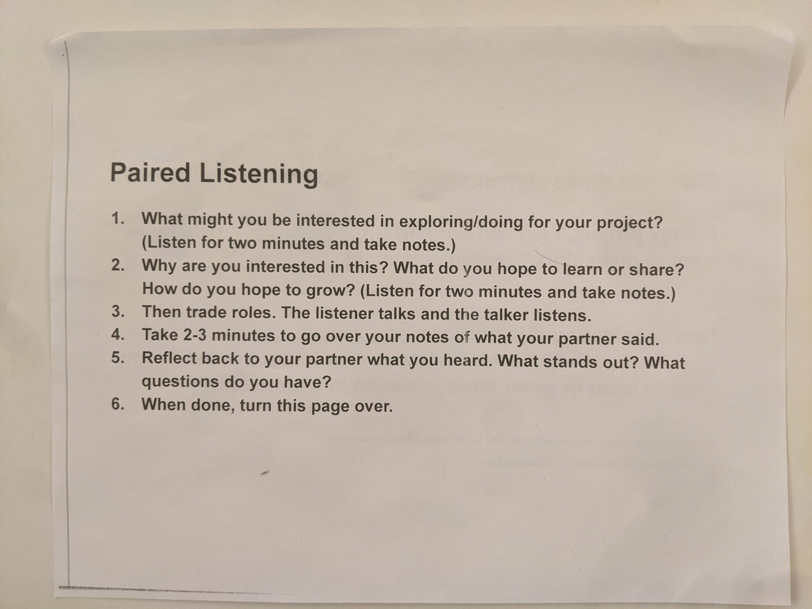
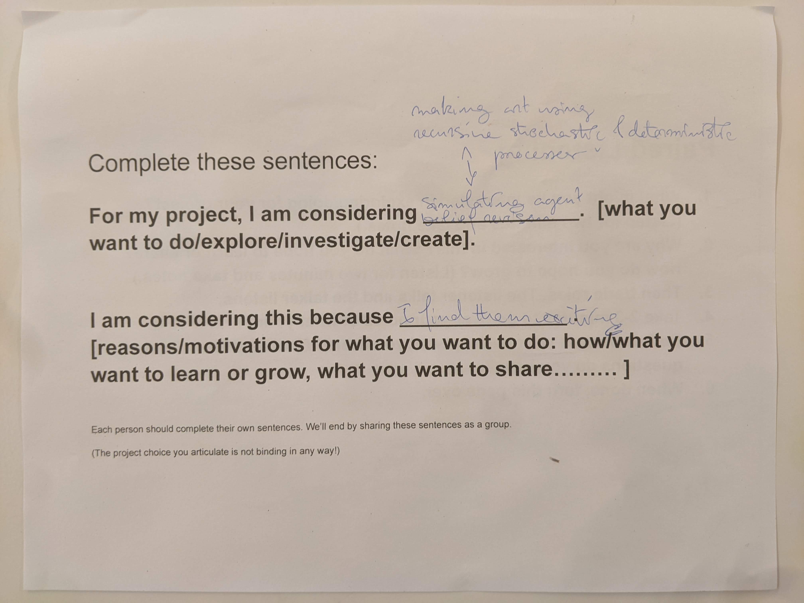

```{r setup, include=FALSE}
knitr::opts_chunk$set(echo = TRUE)
library(tidyverse)
```

## Readings discussion

**Are there parts of the reading that really struck with you?**

- The fact that frequencies of wars follows a power law is amazing.
- Turbulence is self-similar at different scales?

**Are there parts of the reading that you would really like to hear others’ thoughts on?**

- How do people feel about the notion of fractalness of our social environments that is brought up in the emergent Strat reading, and is anybody concerned that the notion might be applied in an under critical way in some contexts?
- In social modelling, does introducing a model present a risk of invalidating the model by the social acknowledgement of the model affecting its outcomes?
- What is fundamentally different about processes that involve collective ideation from more top-down hierarchical processes?
- The emergent strategy readings emphasised collaborative organisation over hierarchical organisation, but I feel that it’s promotion of collaborative organisation everywhere is a little rushed and uncritical. See: Jen Schradie - hierarchy provides conservative movements in the USA with a huge organisational advantage. 
- ^^ Notion of a leaderful group in which everyone is participating in a leadership role in different (and often changing) ways as an inbetween state between hierarchical organisation and collaborative unhierarchical organisation. Organisation needn’t follow an implied binary between hierarchy and collaboration.
- Hierarchy is often fractal in that it is self similar.

Idea (mentionned by Gray): Discoveries are unpredictable because if they were predictable, someone would have already discovered them. The unpredictability of discoveries makes history unpredictable. 

## Final project ideas discussion



**My project ideas:**



**My discussion partner’s project ideas:**

- Knitting for a final project
- Geometric fractals stuff - something visual art-y
- Understanding social movements through fractals: building democracy through peace and justice - how can democracy build these qualities
    - Feels very relevant to her life
    - Movement to protect old growth forests
    - Government and democracy at different scales: governmental purview at different scales
