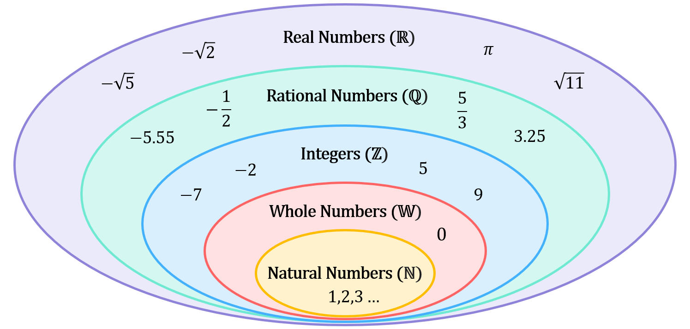
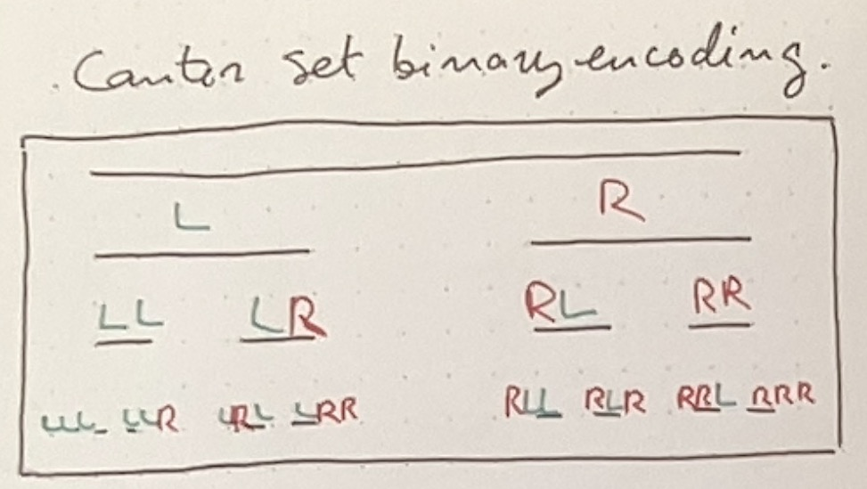

```{r setup, include=FALSE}
knitr::opts_chunk$set(echo = TRUE)
library(tidyverse)
```

## Today's goals

- The size of fractal sets

## A bit of set theory

The size of fractal sets is a set theory question, so let's briefly consider some set theory.

- In mathematics, a set is a collection of things, objects (Denoted by Dave in curly brackets as $\{a, b, c, d, e, \ldots\}$)
- **Two sets are the same size if there is a one-to-one relationship between elements in the sets.**
- The size of a set is referred to as its **cardinality.**

Two sets of the same size: 

- $\{c, a, b\}$
- $\{-1, 5, 3\}$

**Number theory sets:**


**Suppose we have two infinite sets:**

- The set of natural numbers $\mathbb{N} = \{1, 2, 3, 4, 5, \ldots\}$ 
- The set of even numbers $\{2, 4, 6, 8, 10, \ldots\}$

Both sets are equal in cardinality (size) because there is a one-to-one relation between elements in the first and the second.

- In the examples above, we would say that they are countably infinite/countable.
- Their cardinality is $\aleph_0$ (aleph naught).

**What if we consider the unit interval set? The set of all values between 0 and 1.**

...But first! A short detour into numbers:

## Numbers and notation systems

**What does $237$ mean?** It means $(2 \cdot 100)+(3 \cdot 10) + (7 \cdot 1)$. Which also means $(2 \cdot 10 ^2)+(3 \cdot 10^1) + (7 \cdot 10^0)$.

What if we wrote this in binary?

$(1 \cdot 2^7) + (1 \cdot 2^6) + (1 \cdot 2^5) + (1 \cdot 2^4) + (1 \cdot 2^3) + (1 \cdot 2^2) + (0 \cdot 2^1) + (1 \cdot 2^0)$
$= 128 + 64 + 32 + 0 + 8 + 4 + 0 + 1$
$= 11101101$

**What does $0.75$ mean?** It means $7 \cdot \frac{1}{10} + 5 \cdot \frac{1}{100} + 7 \cdot 10^{-1} + 5 \cdot 10^{-2}$

$= \frac{1}{2} + \frac{1}{4}$

What if we wrote this in binary?

$0.11$

## Back to set theory

So the unit interval = the set of all infinite sequences of 0s and 1s. 

Okay, what does that say about the cardinality of the unit interval? What is the cardinality of the unit interval?

- The unit interval is uncountable. Its cardinality is $\aleph_1$
- For more about showing that an infinite set is uncountable, see Cantor's Diagonalisation proof, and this video: $\href{https://www.youtube.com/watch?v=elvOZm0d4H0}{numberphile\ video}$

## The size of fractal sets

Let's take the Cantor set as our first example.

We can encode the set in coordinates using Ls and Rs for left and right. (We can also write the Ls as 0s and the Rs as 1s, this would change nothing about the set). 



You could continue this encoding infinitely, and get the cantor set. 

The Cantor set is the set of all possible infinite sequences of Ls and Rs, or of 0s and 1s. In other words, the Cantor set is uncountably infinite.

For more on transfinite numbers such as $\aleph$, see $\href{https://en.wikipedia.org/wiki/Transfinite_number}{wikipedia\ transfinite\ numbers}$.
