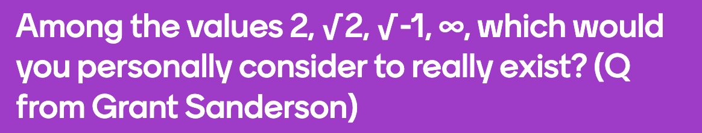
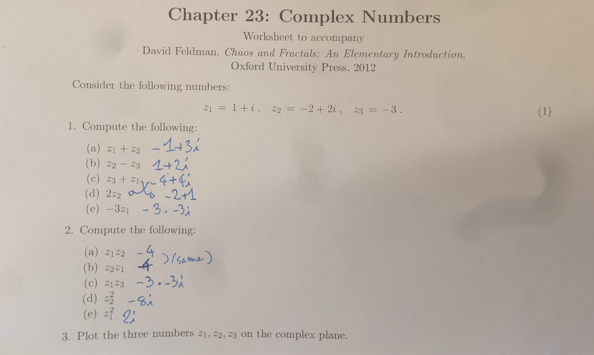
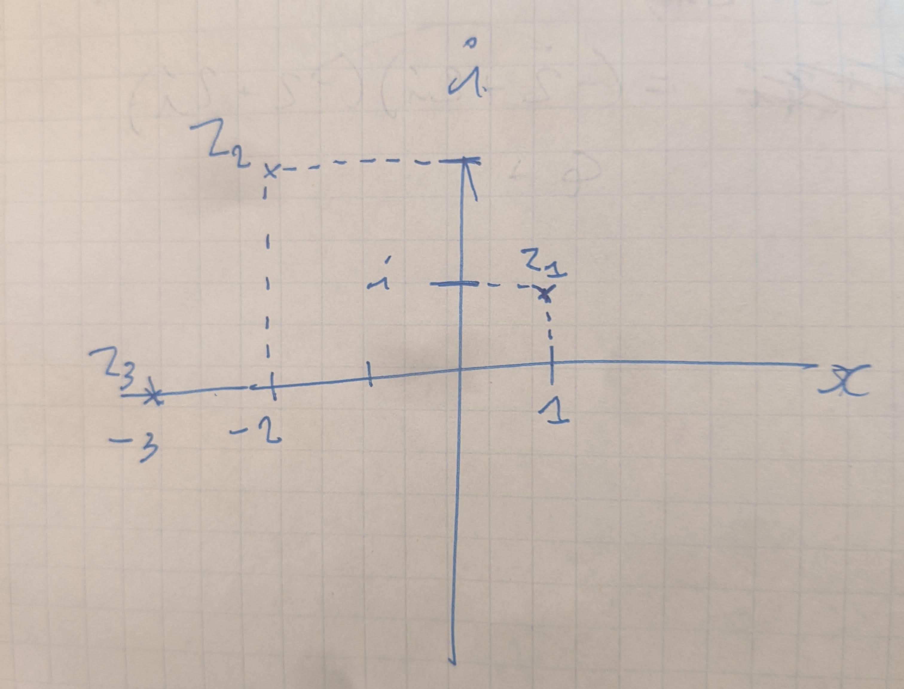
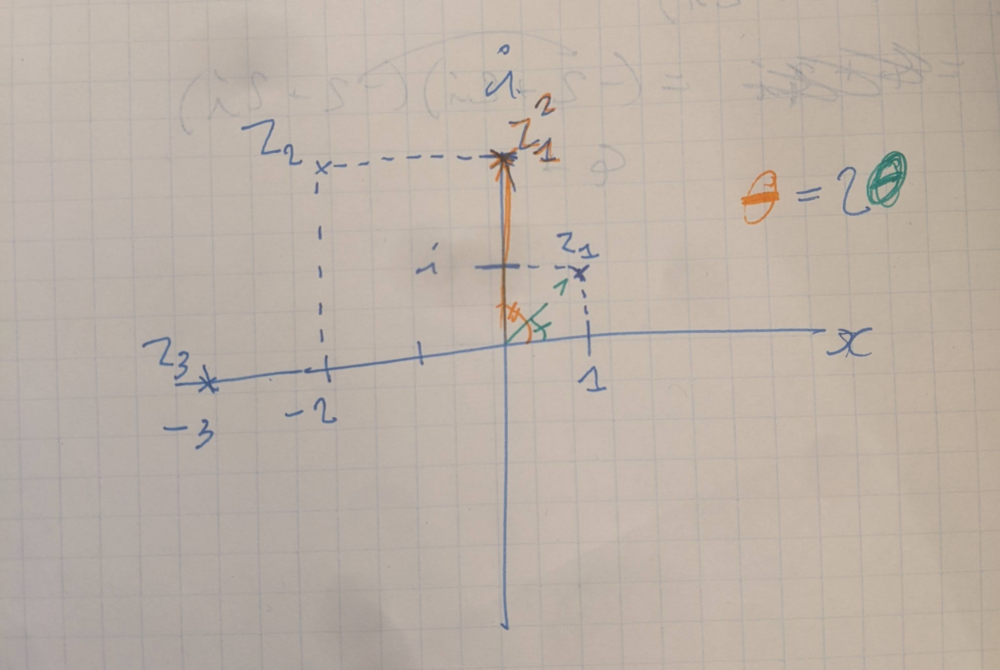

```{r setup, include=FALSE}
knitr::opts_chunk$set(echo = TRUE)
library(tidyverse)
library(ggthemes)
library(ggrepel)
```

## Today's goals

- Midterm check-in
- Complex numbers
- 2d iteration

## Complex Numbers


Let's start by thinking about square roots. Take a positive number: $\sqrt{4} \pm 2$.

Okay, what about the square root of a negative number? Well, we can't get out of trouble in the same way, so let's define our way out of trouble: $\sqrt{-1} = i$, where we define $i$ such that $i^2=-1$. The number $i$ is a unit. We know it as the **imaginary unit**.

For just a moment, let's take for granted that it makes sense to use $i$. If we allow ourselves to do so, we discover that $i$ has some very interesting properties.

- if we take $i$ to be the imaginary unit, then we discover that we can make new numbers along the imaginary number line, numbers like $2i$, or $3.7i$. We can also make numbers that combine imaginary numbers and real numbers, like $3+4i$. These numbers are known as complex numbers.

We need to figure out how to add and multiply complex numbers. (It's traditional to use $Z$ to denote complex numbers in mathematics).

$Z_1 = 3+4i$

$Z_2 = 2-6i$

**Addition with complex numbers:**

$(3+4i) + (2-6i) = (3+2) + (4-6)i$

**Multiplication with complex numbers:**

$(3+4i) \cdot (2-6i)$

$= (3) \cdot (2) + (3) \cdot (-6i) + (4i) \cdot (2) + (4i) \cdot (-6i)$

$= 6 - 18i + 8i - 24i^2$ Note: The  conversion is that if a term is raised to a power without parentheses, the last symbol is raised to that power, not the rest of what it's connected to. For example: $2x ^ 2 = 2 \cdot x^2$ and $(2x) ^ 2 = 2x \cdot 2x$.

## A couple exercises with complex numbers:



## The complex plane

**Since complex numbers have two dimensions, the imaginary and real parts, we can plot them in two dimensions in a space called the complex plane. In complex plane plots, the x axis is typically the real number line, and the y axis is the imaginary number line.**




**Let's plot some complex numbers on the complex plane!**

```{r}
numbers <- c(1+1i, 2+2i, -3.3-1.7i, 1.5-1i, -3+0i, 2.56+0i, 3i, -3.9i)

# let's split the complex numbers into real and imaginary parts to feed to ggplot
real <- Re(numbers)
imaginary <- Im(numbers)
category <- as.factor(c("complex", "complex", "complex", "complex", "real", "real", "imaginary", "imaginary"))

name <- numbers

tibble(real, imaginary, name, category) %>% ggplot(aes(real, imaginary)) + 
  geom_segment(lineend = "round", linejoin = "mitre", 
               arrow = arrow(length = unit(0.3, "cm")), x=0, y=0, 
               xend=real, yend=imaginary, aes(colour=category)) + 
  geom_point() +
  geom_text(aes(label=name), hjust=-.5, vjust = .5) +
  labs(title= "Points on the complex plane:", x="real line", y = "imaginary line") + 
  lims(x=c(-5, 5), y=c(-5, 5)) + 
  coord_equal()
```

Okay, pretty neat, now let's experiment. What if we take a complex number and square it, and then iterate, squaring its square, then that square, then the next, etc? 

**Squaring a complex number has the effect of doubling its angle from an axis on the complex plane.**

```{r}
n <- 3
x_0 <- 1+1i

numbers <- x_0

for(i in 1:n){
  numbers <- c(numbers, tail(numbers, 1)^2)
}

# let's split the complex numbers into real and imaginary parts to feed to ggplot
real <- Re(numbers)
imaginary <- Im(numbers)

name <- rep("Z", length(numbers))
name <- paste0(name, as.character(1:length(numbers)))

complex_sequence <- tibble(real, imaginary, name) 
complex_sequence

complex_sequence %>% ggplot(aes(real, imaginary)) +
  geom_path(lineend = "round", linejoin = "mitre", 
               arrow = arrow(length = unit(0.3, "cm")), 
            colour="coral") +
  geom_point() +
  geom_text_repel(aes(label=name)) +
  labs(title= "Iterated trajectory on the complex plane:", x="real line", y = "imaginary line")

complex_sequence %>% ggplot(aes(real, imaginary)) +
  geom_segment(lineend = "round", linejoin = "mitre", 
               arrow = arrow(length = unit(0.3, "cm")), x=0, y=0, 
               xend=real, yend=imaginary, 
               colour = "springgreen3") + 
  geom_point() +
  geom_text_repel(aes(label=name)) +
  labs(title= "Points on the complex plane:", x="real line", y = "imaginary line")
```
