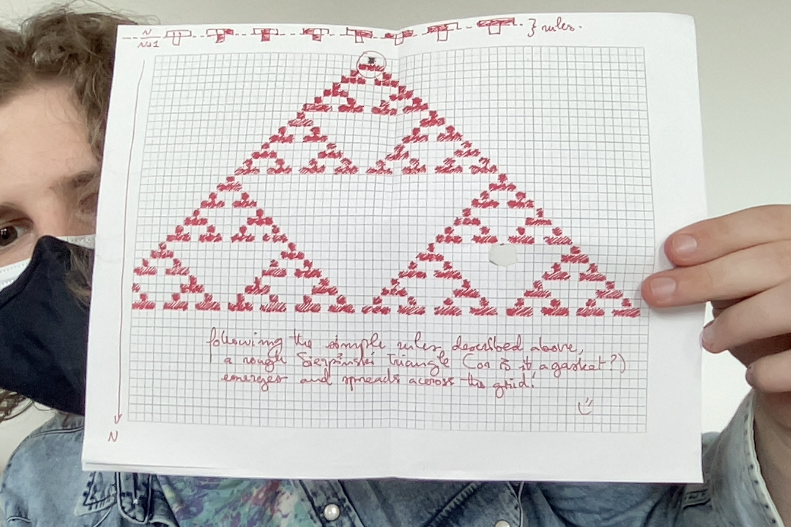

```{r setup, include=FALSE}
knitr::opts_chunk$set(echo = TRUE)
library(tidyverse)
library(ggthemes)
library(ggrepel)
library(magic)
```



## Week 7 Homework code:

```{r}
numbers <- c(-4-2i, 3i, 2+0.5i, -2+0.5i, -2i, 2+0.5i, 4-2i, -4-2i)
numbers_sq <- numbers^2

# let's split the complex numbers into real and imaginary parts to feed to ggplot
real <- Re(numbers)
imaginary <- Im(numbers)
name <- numbers
name2 <- c("z1", "z2", "z3", "z4", "z5", "z6", "z7", "z8")

tibble(real, imaginary, name=paste0(name2, sep=": ", as.character(name))) %>% ggplot(aes(real, imaginary)) + 
  geom_point() +
  geom_path() +
  geom_text_repel(aes(label=name), hjust = -0.5, vjust = -0.5) +
  labs(title= "Points on the complex plane:", x="real line", y = "imaginary line") + 
  coord_equal()
```

```{r}
n <- 4
z_0 <- 3
funky <- function(z){return(z*1i)}

z_n <- z_0
for(i in 1:(n-1)){
  z_n <- c(z_n, funky(tail(z_n, 1)))
}
z_n

tibble(real=Re(z_n), imaginary=Im(z_n), name=z_n) %>% ggplot(aes(real, imaginary)) +
  geom_curve(aes(x=real, y=imaginary, xend=shift(real, -1), yend=shift(imaginary, -1)), 
             arrow = arrow(length = unit(0.3, "cm")), curvature = 0.5,
             colour = "springgreen3") +
  geom_point() + 
  geom_text_repel(aes(label=name)) +
  labs(title= "Points on the complex plane:", x="real line", y = "imaginary line") + 
  coord_equal()

z_0 <- 2i
z_n <- z_0
for(i in 1:(n-1)){
  z_n <- c(z_n, funky(tail(z_n, 1)))
}
z_n

tibble(real=Re(z_n), imaginary=Im(z_n), name=z_n) %>% ggplot(aes(real, imaginary)) +
  geom_curve(aes(x=real, y=imaginary, xend=shift(real, -1), yend=shift(imaginary, -1)), 
             arrow = arrow(length = unit(0.3, "cm")), curvature = 0.5,
             colour = "springgreen3") +
  geom_point() + 
  geom_text_repel(aes(label=name)) +
  labs(title= "Points on the complex plane:", x="real line", y = "imaginary line") + 
  coord_equal()
```

```{r}
n <- 4
z_0 <- 3
funky <- function(z){return(z*1i)}

z_n <- z_0
for(i in 1:(n-1)){
  z_n <- c(z_n, funky(tail(z_n, 1)))
}
z_n

data <- z_n

z_0 <- 2i
z_n <- z_0
for(i in 1:(n-1)){
  z_n <- c(z_n, funky(tail(z_n, 1)))
}
z_n

data <- c(data, z_n)
group <- c(rep("z_0 = 3", 4), rep("z_0 = 2i", 4))

tibble(real=Re(data), imaginary=Im(data), name=data, group=group) %>% ggplot(aes(real, imaginary)) +
  geom_curve(aes(x=real, y=imaginary, xend=c(shift(real[1:4], -1), shift(real[5:8], -1)), 
                 yend=c(shift(imaginary[1:4], -1), shift(imaginary[5:8], -1)),
                 colour = group), 
             arrow = arrow(length = unit(0.3, "cm")), curvature = 0.5) +
  geom_point() + 
  geom_text_repel(aes(label=name)) +
  labs(title= "Points on the complex plane:", x="real line", y = "imaginary line") + 
  coord_equal()
```
```{r}
options(scipen = 100)

base_n_val <- 0.01 # in this case, let's say the base is 10
goal_base <- 2 # we are converting notation to base 2

value <- 0:-14
value <- 2^value

presence <- c(0,0,0,0,0,0,0,0,0,0,1,0,0,0,1)

tibble("Decimal value"=value, "Presence/Absence"=presence)
data <- tibble(value, presence)
data

data %>% filter(presence == 1) %>% summarise(sum(value))
```

