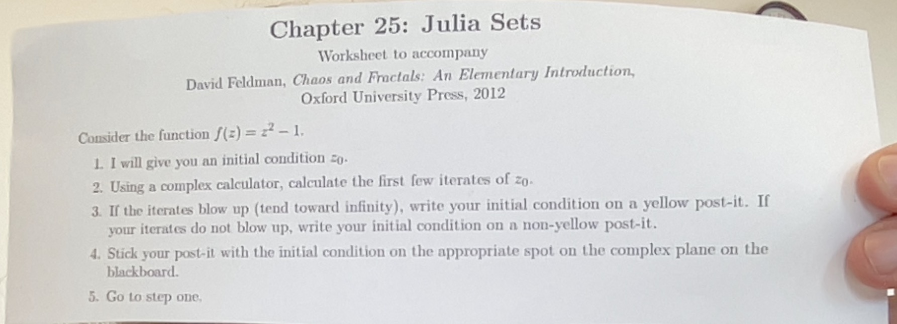
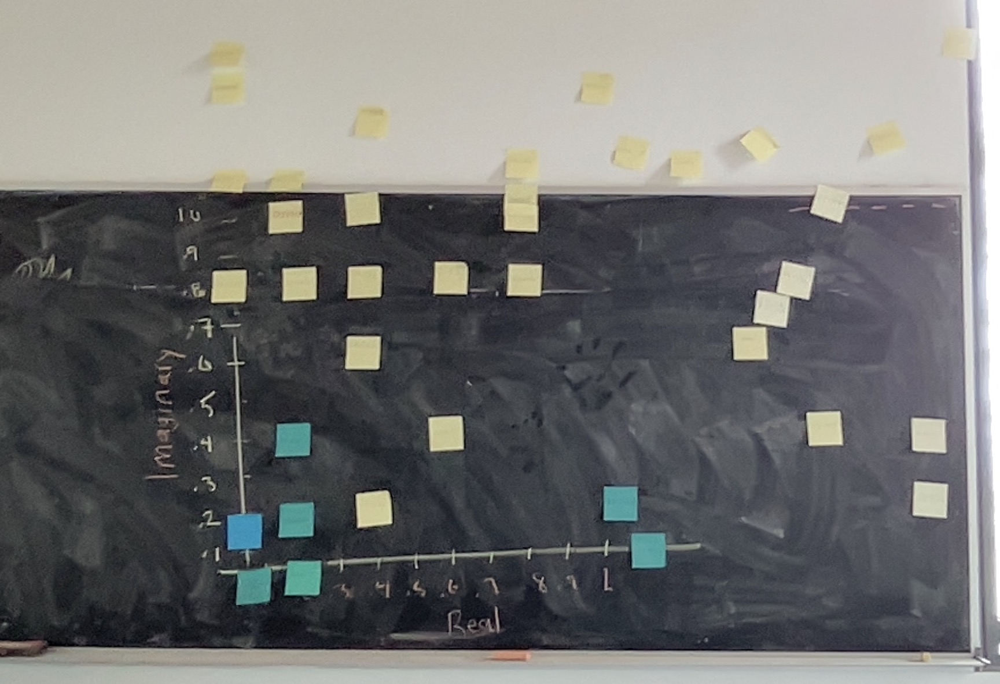
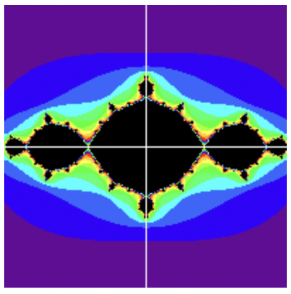

```{r setup, include=FALSE}
knitr::opts_chunk$set(echo = TRUE)
library(tidyverse)
library(ggthemes)
library(ggrepel)
library(magic)
```

## Today's goals

- Cellular Automata
- Julia Set Activity
- Hénon Map

## Cellular Automata (CAs)

"A cellular automaton is a collection of "colored" cells on a grid of specified shape that evolves through a number of discrete time steps according to a set of rules based on the states of neighboring cells. The rules are then applied iteratively for as many time steps as desired." $\href{https://mathworld.wolfram.com/CellularAutomaton.html#:~:text=A%20cellular%20automaton%20is%20a,many%20time%20steps%20as%20desired.}{(Wolfram\ Mathworld)}$

$\href{https://en.wikipedia.org/wiki/Cellular_automaton}{Cellular\ Automaton,\ Wikipedia}$

See things like Conway's game of life. 

Things to think about: 

- Cellular automata are typically on grid worlds. But how would continuous-space-inhabiting cellular automata differ from grid-world-inhabiting ones?

## Complex numbers

Complex numbers are numbers composed of real numbers + a number of imaginary units (i). The imaginary unit i has the property that $i^2=-1$

**Complex number coordinate plotter:**

Let's do an quick experiment with complex numbers:



For some values of $Z_0$, iterating the function will cause the iterates to blow up to infinity.



Let's ask a computer to do this for us. We get something like this, where the colour coding represents the amount of time it takes for an orbit to blow up to infinity, and black means the orbit does not blow up to infinity:



In the in-class example, we were plotting only the upper-right quadrant. 

We're now ready to talk about Julia Sets.

## Julia Sets

A Julia set is the set of all initial conditions $Z_0$ that do not blow up to infinity when iterated through a given function. It could be any function. Julia sets are also called prisoner sets. One of the most common function types for generating Julia Sets are $Z^2+C$, where $C$ and $Z$ are complex numbers (including purely real and purely imaginary numbers, $Z=0+2i$, and $C=3+0i$ both count). (Some Julia Sets are known as fractal cacti)

For a given initial condition, we can use a program to plot the corresponding orbit of the function on the complex plane like so:

**Complex number function iterator:**

```{r}
options(scipen = 100)

n <- 15
z_0 <- -0.2+0.4i
c <- -1
funky <- function(z){return(z^2+c)}

z_n <- z_0
for(i in 1:(n-1)){
  z_n <- c(z_n, funky(tail(z_n, 1)))
}
z_ends <- shift(z_n, -1)[1:(n-1)]
z_ends <- append(z_ends, NA)
names <- paste0("Z_", 1:n)

segments <- tibble(real=Re(z_n), imaginary=Im(z_n), realends=Re(z_ends), imaginaryends=Im(z_ends))
data <- tibble(real=Re(z_n), imaginary=Im(z_n), name=names) 

data 

data %>% ggplot(aes(real, imaginary)) +
  geom_segment(data=segments, aes(x=real, y=imaginary, xend=realends, yend=imaginaryends),
             arrow = arrow(length = unit(0.3, "cm")),
             colour = "springgreen3") +
  geom_point() + 
  geom_text_repel(aes(label=name), hjust = .5, vjust = .5) +
  labs(title= "Points on the complex plane:", x="real line", y = "imaginary line") # + 
  # coord_equal()
```
Today, I don't have the time to code a a Julia set plotter, but maybe a little further down the line it will appear in my notes. 

In the meantime, here's a version that someone else made: $\href{https://sciencedemos.org.uk/julia.php}{Julia\ set\ plotter}$
