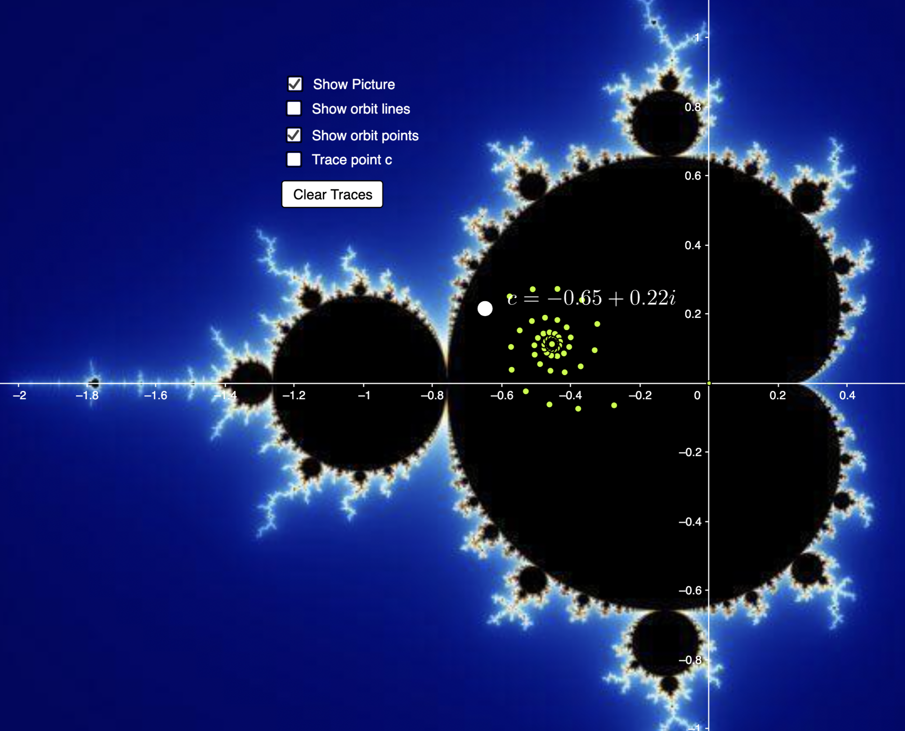

```{r setup, include=FALSE}
knitr::opts_chunk$set(echo = TRUE)
library(tidyverse)
library(ggthemes)
library(ggrepel)
library(magic)
library(lubridate)
library(zeallot)
library(viridis)

clear_theme <- theme(legend.position="none",
                     panel.background = element_rect(fill="white"),
                     plot.margin=grid::unit(c(1,1,0,0), "mm"),
                     panel.grid=element_blank(),
                     axis.ticks=element_blank(),
                     axis.title=element_blank(),
                     axis.text=element_blank())
```

## Questions to ask Dave

- :( How likely am I to get out of the waitlist for SFI?

## Today's goals

- Julia set Menagerie (Sharing Julia Sets)
- Julia set "Map"
- Hénon Map

## Julia set Menagerie and Julia set map (Mandelbrot set)

We are looking at prisonner sets: Julia sets to be more exact. The Julia set examples we are working with are generated isng the function $f(z)=z^2+c$. 

We see that different C values produce different shapes. How does that work? What is going on? How can we vary C to get predictable results?

Let's look at a bunch of different C values. 

Suppose we were to plot the C values of different Julia sets on the complex plane. If the Julia set produced by a value of C contains disconnected masses, let's colour the point corresponding to C on the complex plane one colour. If the Julia set produced by the value of C is one solit mass, let's colour it another colour.

The resulting shape if we cover the complex plane is the Mandelbrot set. A point C is in the Mandelbrot set if its Julia set is connected, and is not, if its Julia set is not connected.

**Question: How do you know mathematically if a Julia set is connected or not?** Is connectedness a binary? Or are there degrees of connectedness/disconnectedness?

```{r}
c <- c(-.63+.43i, -1+.284i, 3+.5i, -5+.25, -.1-.99i, -.77+.25i, -1.4-.2i, 0.67+.4i, 
       -.337-.639i, .382+.37i, -.9+.3i, -1.2+.25i, .185+.58, 0.134+0.6i, 
       .378+2.87i, -.72+.3088i, -.32-.62i, 1.7+1.3i)
name <- c("snowflakes", "the eternal fire", "dish detergent", "hard-boiled egg cut in 1/2",
          "toothpicks", "whirlpool", "scar tissue", "broccoli", "secret snail", 
          "cyclones", "two-headed snake", "thin ice", "hotdog", "octobus bad day", 
          "Avalon city NJ", "flowers of the universe", "Susan", "little guys with eyes") # student-assigned name of the fractal

julias <- tibble(c, name)
julias

real <- Re(c); imaginary <- Im(c)
tibble(real, imaginary) %>% ggplot(aes(real, imaginary)) + geom_point() + coord_equal()
```

Let's plot the Julia sets corresponding to these values of C:

```{r}
# let's define our Julia formula
julia <- function(z, c){
  return(z^2+c) 
}
```

```{r}
# let's define a sample value of c
c <-  0.355+0.355i
```

```{r}
# let's define a maximum number of steps to decide if an orbit blows up to infinity or not
max_iter <- 35
# now let's define the limits and detail of our plot

# x and y limits (corresponding to real and imaginary)
x <- c(-2, 2); y <- c(-2, 2)
# horizontal and vertical resolution (the number of data points between limits)
h_res <- 1000; v_res <- 1000

real_line <- seq(x[1], x[2], length=h_res)
imaginary_line <- seq(y[1], y[2], length=v_res)*1i

space_grid <- outer(real_line,imaginary_line,"+") %>% c()

z <- space_grid
for(i in 1:max_iter){
  # apply the Julia function to every z_0 value
  z <- julia(z, c) 
}

julia_data <- tibble(r=Re(space_grid), 
                     i=Im(space_grid), 
                     z=as.vector(exp(-Mod(z)))) %>% na.omit()


# plot

julia_data %>% ggplot(aes(r, i, fill=z)) +
  geom_raster(interpolate = T) +
  scale_x_continuous(expand=c(0,0)) +
  scale_y_continuous(expand=c(0,0)) +
  scale_fill_viridis(option="mako") +
  clear_theme + 
  coord_equal()
```

Somehow, along the way, I also got this. I don't know what it is, but I thought it looked interesting. I might explore it further later.

```{r}
c <- -1.1193+0.2718i

max_iter <- 256

width = 256
height = 256

centre <- 0+0i
extent <- 4.0+3.0i
scale <- max((Re(extent/width)), Im((extent/height)))

result <- matrix(rep(NA, width*height), nrow=height, ncol=width)

for(i in 1:height){
  for(j in 1:width){
    z <- centre + (j - width %/% 2 + (i - height %/% 2)*1i) * scale
    for(k in 1:max_iter){
      z <- z^2 + c
      if(Re(z * Conj(z)) > 4){
        next
      }
      result[i, j] <- z/k
    }
  }
}

result %>% c() %>% tibble(values =.) %>% 
  ggplot(aes(x=Re(values), y=Im(values))) +
  geom_point(size=0.1)

```

And this:

```{r}
c <- -1.1193+0.2718i

max_iter <- 256

width = 256
height = 256

centre <- 0+0i
extent <- 4.0+3.0i
scale <- max((Re(extent/width)), Im((extent/height)))

result <- matrix(rep(NA, width*height), nrow=height, ncol=width)

for(i in 1:height){
  for(j in 1:width){
    z <- centre + (j - width %/% 2 + (i - height %/% 2)*1i) * scale
    for(k in 1:max_iter){
      z <- z^2 + c
      if(Re(z * Conj(z)) > 4){
        next
      }
      result[i, j] <- z
    }
  }
}

result %>% c() %>% tibble(values =.) %>% 
  ggplot(aes(x=Re(values), y=Im(values))) +
  geom_point(size=0.1)
```

Anyway, back to these Julia sets: Let's plot all the Julia sets people brought into class today.

```{r}
# plot settings

# x and y limits (corresponding to real and imaginary)
x <- c(-2, 2); y <- c(-2, 2)
# horizontal and vertical resolution (the number of data points between limits)
h_res <- 500; v_res <- 500

# max iterations
max_iter <- 50

for(c in julias$c){
  c <- c
  real_line <- seq(x[1], x[2], length=h_res)
  imaginary_line <- seq(y[1], y[2], length=v_res)*1i
  
  space_grid <- outer(real_line,imaginary_line,"+") %>% c()
  
  z <- space_grid
  for(i in 1:max_iter){
    # apply the Julia function to every z_0 value
    z <- julia(z, c) 
  }
  
  julia_data <- tibble(r=Re(space_grid), 
                       i=Im(space_grid), 
                       z=as.vector(exp(-Mod(z)))) %>% na.omit()
  
  
  # plot
  plot <- julia_data %>% ggplot(aes(r, i, fill=z)) +
    geom_raster(interpolate = F) +
    scale_x_continuous(expand=c(0,0)) +
    scale_y_continuous(expand=c(0,0)) +
    scale_fill_viridis(option="mako") +
    clear_theme + 
    coord_equal()
  
  print(plot)
}
```

Plots that returned nothing were probably of sets too whispy to be captured by my plotting algorithm's resolution. It is also possible that they do not appear because this algorithm does not colour code values which are not part of Julia sets for a given $c$, whereas some other algorithms do, but differentiate between points in and outside the set by colour-coding the orbit based on its rate of growth, or average rate of growth. 

Now let's plot the Mandelbrot set:

Check this out later: (https://realpython.com/mandelbrot-set-python/)

```{r}
x <- c(-2.2, 1); y <- c(-1.1, 1.1)
h_res <- 1000; v_res <- 1000

max_iter <- 35

real_line <- seq(x[1], x[2], length=h_res)
imaginary_line <- seq(y[1], y[2], length=v_res)*1i

space_grid <- outer(real_line,imaginary_line,"+") %>% c()

z <- 0
c <- space_grid
for(i in 1:max_iter){
  z <- z^2 + c
}

mandelbrot_data <- tibble(r=Re(space_grid), 
                     i=Im(space_grid), 
                     z=as.vector(exp(-Mod(z)))) %>% na.omit()


# plot
mandelbrot_data %>% ggplot(aes(r, i, fill=z)) +
  geom_raster(interpolate = F) +
  scale_x_continuous(expand=c(0,0)) +
  scale_y_continuous(expand=c(0,0)) +
  scale_fill_viridis(option="mako") +
  clear_theme + 
  coord_equal()
```

Check this out: https://www.geogebra.org/m/BUVhcRSv#material/XQprvGbW



The Mandelbrot set is an encyclopaedia of Julia sets. 

**Bonus Question:** What would the prisoner set of the logistic equation look like, with complex terms (at least r, possibly also x in some capacity)

## Hénon map

Recall $f(x)=rx(1-x)$. 

$X_{n+1}=rx_n(1-x_n)$

(This is just to remind you of how iteration functions work)

Let's define a new function:

```{r}
n <- 10000
x_0 <- 0.8
y_0 <- 1

a <- 0.155; b <- 0.6

henon_next_point <- function(x, y, a, b){
  new_x <- y+1-a*x^2
  new_y <- b*x
  return(list(new_x, new_y))
}

find_coordinates_for_n_iterations <- function(x_0, y_0, n){
  x_coord_list = c(x_0)
  y_coord_list = c(y_0)
  x <- NA; y <- NA
  for(i in 1:n){
    c(x,y) %<-% henon_next_point(tail(x_coord_list, 1), 
                                 tail(y_coord_list, 1), a, b)
    
    x_coord_list = c(x_coord_list,x)
    y_coord_list = c(y_coord_list, y)
  }
  return(tibble(x_coord_list, y_coord_list))
}

```

For some initial conditions and values of a and b, the orbit of the function forms an attractor of period 2.

```{r}
henon_coordinates <- find_coordinates_for_n_iterations(x_0, y_0, n)
henon_coordinates
henon_coordinates %>% ggplot(aes(x_coord_list, y_coord_list)) + geom_point(size=0.5) +
  labs(x="real line", y="imaginary line")
```

```{r}
x_0 <- 0
y_0 <- 0

a <- 0.155; b <- 0.6

henon_coordinates <- find_coordinates_for_n_iterations(x_0, y_0, n)
henon_coordinates %>% ggplot(aes(x_coord_list, y_coord_list)) + geom_point(size=0.5) +
  labs(x="real line", y="imaginary line")
```

However, for some other initial conditions and values of a and b, the orbits form a strange attractor: The following shape is known as the Hénon attractor.

```{r}
x_0 <- 0
y_0 <- 0

a <- 1.4; b <- 0.3

henon_coordinates <- find_coordinates_for_n_iterations(x_0, y_0, n)
henon_coordinates <- henon_coordinates %>% mutate(time=row_number())

# spacial plot
henon_coordinates %>% ggplot(aes(x_coord_list, y_coord_list)) + geom_point(size=0.1) +
  labs(x="real line", y="imaginary line")

# time series plot of the first 100 iterations
head(henon_coordinates, 100) %>% 
  pivot_longer(-time, names_to = "names", values_to = "values") %>% 
  rowwise() %>% ggplot(aes(time, values, colour=names)) + geom_line()
```
