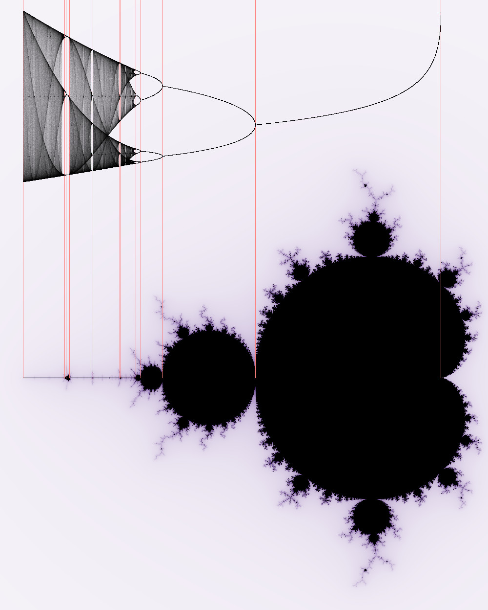
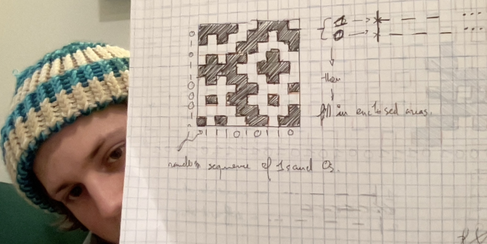

```{r setup, include=FALSE}
knitr::opts_chunk$set(echo = TRUE)
library(tidyverse)
library(ggthemes)
library(ggrepel)
library(magic)
library(lubridate)
library(zeallot)

clear_theme <- theme(legend.position="none",
            panel.background = element_rect(fill="white"),
            plot.margin=grid::unit(c(1,1,0,0), "mm"),
            panel.grid=element_blank(),
            axis.ticks=element_blank(),
            axis.title=element_blank(),
            axis.text=element_blank())
```

## To look into 

- Possible internships on exploratory mathematics with https://experiences.mathemarium.fr/
- 

## Julia 

(J-set = Julia set, M-set = Mandelbrot set)

J-set for a particular c $=$ a set of all $Z_0$'s that do not $\rightarrow \infty$ when iterated (prisoner set). J-sets are described by the function $f(z)=z^2+c$.

M-set $=$ set of all parameters c whose J-set is connected (J-set map, or encyclopaedia). The set of all parameters $c$ for which $Z_c=0$ does not got to $\infty$ when iterated.

**Note the following about Julia sets: When varying C, the splitting point of a Julia set is always in the middle. **

This is really useful, because we can query the point $z_c=0+0i$ to determine if a $c$ value is part of the Mandelbrot set. If the orbit of $z_{n+1} = z_{n}^2 + c$ goes to infinity for $z_0=0+0i$, (or, since an orbit cannot return if it goes beyond 4 units from the origin, trust me, Dave told me so), then the value of $c$ is not part of the Mandelbrot set.

Also note: The period of orbits on the Mandelbrot set aligns with the bifurcation diagram of the logistic map.



## Dashed line (knitting pattern game)

Let's try a game where we make knitting patterns: 



Okay, how does that look in code?

```{r}
# canvas settings
len <- 50
number <- 2 # desired number of unique patterns

for(i in 1:number){
  row_values <- sample(c(0, 1), len, replace=T) # 0 or 1 values
  col_values <- sample(c(0, 1), len, replace=T) # 0 or 1 values
  
  # paste(c("row values: ", row_values), collapse=" ")
  # paste(c("col values: ", col_values), collapse=" ")
  
  zero <- seq(1, by=2, length=(len %/% 2)) 
  one <- seq(0, by=2, length=(len %/% 2))
  
  # paste(c("zero sequence: ", zero), collapse=" ")
  # paste(c("one sequence: ", one), collapse=" ")
  
  dash_line_coords <- function(values){
    ticks <- c()
    for(v in values){
      if(v == 0){ticks <- c(ticks, zero)} 
      else if(v == 1){ticks <- c(ticks, one)}
    }
    return(ticks)
  }
  
  x <- c(); y <-c() # ticks
  x <- dash_line_coords(row_values) # x ticks
  y <- dash_line_coords(col_values) # y ticks
  
  # x y xend yend format for geom_segment:
  hx <- x; hy <- rep(1:(len), each=(len %/% 2))
  hxend <- x+1; hyend <- hy
  
  vx <- rep(1:(len), each=(len %/% 2)); vy <- y
  vxend <- vx; vyend <- y+1
  
  plot <- tibble(hx, hy, hxend, hyend, 
         vx, vy, vxend, vyend) %>% 
    ggplot() + 
    geom_segment(aes(x=hx, y=hy, xend=hxend, yend=hyend)) + 
    geom_segment(aes(x=vx, y=vy, xend=vxend, yend=vyend)) + clear_theme + coord_equal()
  
  # when in a for loop, you have to explicityl print your plots:
  print(plot)
}
```

