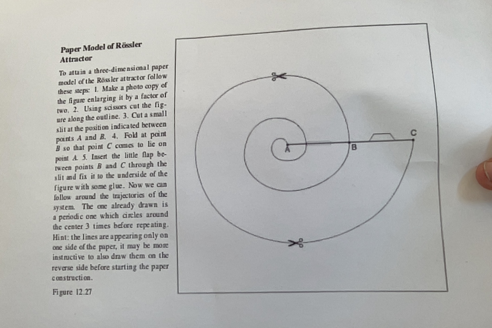

```{r setup, include=FALSE}
knitr::opts_chunk$set(echo = TRUE)
library(tidyverse)
library(ggthemes)
library(ggrepel)
library(magic)
library(lubridate)
library(zeallot)

clear_theme <- theme(legend.position="none",
            panel.background = element_rect(fill="white"),
            plot.margin=grid::unit(c(1,1,0,0), "mm"),
            panel.grid=element_blank(),
            axis.ticks=element_blank(),
            axis.title=element_blank(),
            axis.text=element_blank())
```

## To look into 

- Possible internships on exploratory mathematics with https://experiences.mathemarium.fr/
- Okay, wouldn't it be cool to learn about differential equations? (need to brush up on calculus I, II, III)

## Today's goals

- Strange Attractors

## Strange attractors (recap from a couple classes ago)

The Henon Attractor is a strange attractor:

Wikipedia: An attractor is called strange if it has a fractal structure. $\href{https://en.wikipedia.org/wiki/Attractor#Strange_attractor}{href{https://en.wikipedia.org/wiki/Attractor#Strange_attractor)$

"In the mathematical field of dynamical systems, an attractor is a set of states toward which a system tends to evolve,[2] for a wide variety of starting conditions of the system. System values that get close enough to the attractor values remain close even if slightly disturbed.

In finite-dimensional systems, the evolving variable may be represented algebraically as an n-dimensional vector. The attractor is a region in n-dimensional space. In physical systems, the n dimensions may be, for example, two or three positional coordinates for each of one or more physical entities; in economic systems, they may be separate variables such as the inflation rate and the unemployment rate.

If the evolving variable is two- or three-dimensional, the attractor of the dynamic process can be represented geometrically in two or three dimensions, (as for example in the three-dimensional case depicted to the right). An attractor can be a point, a finite set of points, a curve, a manifold, or even a complicated set with a fractal structure known as a strange attractor. If the variable is a scalar, the attractor is a subset of the real number line. Describing the attractors of chaotic dynamical systems has been one of the achievements of chaos theory." - From the same Wikipedia entry.

**Visualising the Henon attractor:**

```{r}
n <- 10000

x_0 <- 0
y_0 <- 0

a <- 1.4; b <- 0.3

henon_next_point <- function(x, y, a, b){
  new_x <- y+1-a*x^2
  new_y <- b*x
  return(list(new_x, new_y))
}

find_coordinates_for_n_iterations <- function(x_0, y_0, n){
  x_coord_list = c(x_0)
  y_coord_list = c(y_0)
  x <- NA; y <- NA
  for(i in 1:n){
    c(x,y) %<-% henon_next_point(tail(x_coord_list, 1), 
                                 tail(y_coord_list, 1), a, b)
    
    x_coord_list = c(x_coord_list,x)
    y_coord_list = c(y_coord_list, y)
  }
  return(tibble(x_coord_list, y_coord_list))
}

henon_coordinates <- find_coordinates_for_n_iterations(x_0, y_0, n)
henon_coordinates <- henon_coordinates %>% mutate(time=row_number())

# spacial plot
henon_coordinates %>% ggplot(aes(x_coord_list, y_coord_list)) + geom_point(size=0.1) +
  labs(x="real line", y="imaginary line")

# time series plot of the first 100 iterations
head(henon_coordinates, 100) %>% 
  pivot_longer(-time, names_to = "names", values_to = "values") %>% 
  rowwise() %>% ggplot(aes(time, values, colour=names)) + geom_line()
```

## Differential equations and the Rössler attractor

The following three equations together are known as the Rössler equations (spelled like with an umlaut, but I can't be bothered in Rmarkdown to figure that out).

They are differential equations. On the left terms, you have the derivatives, or rates of changes, or velocities, and on the right terms, you have instructions on how to calculate the velocities. 

$\frac{dx}{dt}=-y-z$

$\frac{d}{dt}=x+ay$

$\frac{dz}{dt}=b+zx-cz$

These three equations form a dynamical system. 

Imagine a magic bird flying around space and leaving a trail of glowing air. If the equations above described the rules of movement of this bird, the the bird's trajectory would trace an orbit in the dynamical system for the initial condition of the position of a position of the bird (for example, the position of the bird when we start paying attention to it).

Varying the starting position of the bird is equivalent to varying the $x$ and $y$, and $z$ parameters of the Rössler system of differential equations.

We can also vary the parameters of the Rössler system by changing the values of $a$, $b$, and $c$.

Note: You can get periodic and chaotic orbits in the Rossler system.

If we plot an orbit of the Rössler system, it will look something like this:


We can also produce this shape by cutting and folding paper, like so:


Here are instructions in case you'd like to do it again:



Code version:

```{r}

```

## The Lorenz equations and attractor

Note: You can get also get periodic and chaotic orbits in the Lorenz system.

Code version:

```{r}

```

## Stretching and folding

Note that for all these systems, the source of the chaos is a stretching and folding behaviour.

You can read more about this here: (see the decomposition of the Henon map) $\href{https://en.wikipedia.org/wiki/H%C3%A9non_map}{https://en.wikipedia.org/wiki/H%C3%A9non_map}$
and here: $\href{https://en.wikipedia.org/wiki/Horseshoe_map}{https://en.wikipedia.org/wiki/Horseshoe_map}$