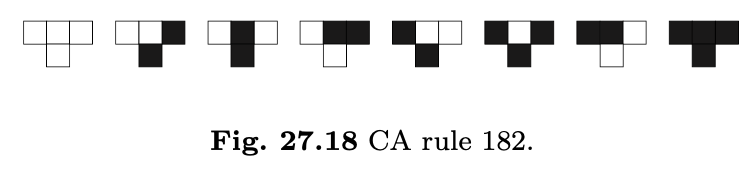
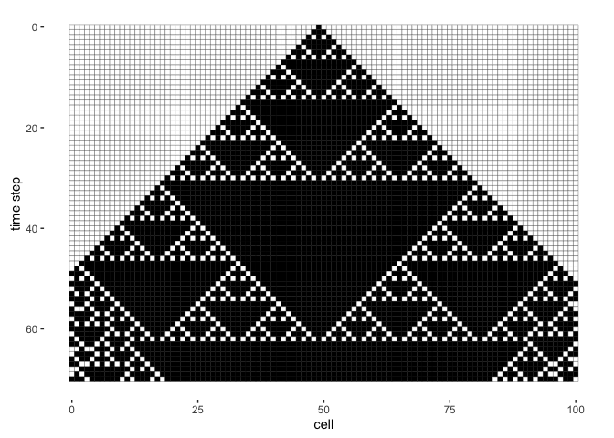

Take this cellular automata rule:



``` r
# let's define the row of cells at timestep n = 0
# HERE IS WHERE YOU CHANGE INITIAL CONDITIONS

# I have included some fun suggestions: 

# initial_conditions <- rep(c(0, 1, 1, 0), 52)
# initial_conditions <- rep(c(0, 1, 0), 52)
# initial_conditions <- sample(c(0, 1), 100, replace = T)
# initial_conditions[length(initial_conditions) %/% 2] <- 1

# the Fibonacci initial conditions
# width <- 100 # approximate width
# fibb <- c(1)
# while(sum(fibb)<width){
#   fibb <- c(fibb, sum(tail(fibb, 2)))
# }
# initial_conditions <- c()
# for(i in fibb){
#   initial_conditions <- c(initial_conditions, rep(sample(c(0, 1), 1), length=i))
# }

# inverting copier initial conditions / flipper machine initial conditions (start with F, next is T, next is TF, ...)
# iterations <- 7
# initial_conditions <- c(F)
# for(i in 1:iterations){
#   initial_conditions <- c(initial_conditions, !initial_conditions)
# }

initial_conditions <- rep(0, 101)
initial_conditions[(length(initial_conditions) %/% 2)] <- 1
# initial_conditions[1] <- initial_conditions[length(initial_conditions)] <- 1

# and let's decide how many timesteps to apply the rule
n <- 70

last_conditions <- new_conditions <- data <- initial_conditions
x <- rep(0:(length(initial_conditions)-1), n+1)
y <- rep(0:n, each=length(initial_conditions))

for(i in 1:n){
  for(j in 1:length(new_conditions)){
    
    # check if the cell has left or right neighbours
    left_neighbour <- F; right_neighbour <- F
    if(j>1){left_neighbour <- T}
    if(j<length(new_conditions)){right_neighbour <- T}
    
    # update each cell
    values <- c()
    if(left_neighbour){values[1] <- last_conditions[j-1]} else {values[1] <- 0}
    if(right_neighbour){values[3] <- last_conditions[j+1]} else {values[3] <- 0}
    values[2] <- last_conditions[j]
    values <- paste(values, collapse = "")
    
    # THIS IS WHERE YOU CHANGE THE CELLULAR AUTOMATA RULES 
    
    # I have included some suggestions for you to try out:
    
    if(values == "000" | values == "011" | values == "110"){new_conditions[j] <- 0}else{new_conditions[j] <- 1}
    # if((values == "101" | values == "001" | values == "100")){new_conditions[j] <- 0}else{new_conditions[j] <- 1}
    # if((values == "101" | values == "001" | values == "110")){new_conditions[j] <- 0}else{new_conditions[j] <- 1}
    # if((values == "101" | values == "001" | values == "011")){new_conditions[j] <- 0}else{new_conditions[j] <- 1}
    # if((values == "111" | values == "000" | values == "011")){new_conditions[j] <- 0}else{new_conditions[j] <- 1}
    # if((values == "111" | values == "000")){new_conditions[j] <- 0}else{new_conditions[j] <- 1}
    # if((values == "011" | values == "000" | values == "100")){new_conditions[j] <- 0}else{new_conditions[j] <- 1}
    # if((values == "010" | values == "001" | values == "100")){new_conditions[j] <- 0}else{new_conditions[j] <- 1}
    # if((values == "010" | values == "000" | values == "111")){new_conditions[j] <- 0}else{new_conditions[j] <- 1}
    # if((values == "010" | values == "111")){new_conditions[j] <- 0}else{new_conditions[j] <- 1}
    # if((values == "101" | values == "001" | 
    #     values == "100" | values == "010")){new_conditions[j] <- 0}else{new_conditions[j] <- 1}
    # if(!(values == "101" | values == "001" | 
    #     values == "100" | values == "010")){new_conditions[j] <- 0}else{new_conditions[j] <- 1}
    # if(!(values == "111" | values == "001" | 
    #     values == "100" | values == "010")){new_conditions[j] <- 0}else{new_conditions[j] <- 1}
    # if(!(values == "111" | values == "000" | 
    #     values == "100" | values == "010")){new_conditions[j] <- 0}else{new_conditions[j] <- 1}
    # if(!(values == "111" | values == "000" | values == "010")){new_conditions[j] <- 0}else{new_conditions[j] <- 1}
    # if(!(values == "011" | values == "110" | values == "000")){new_conditions[j] <- 0}else{new_conditions[j] <- 1}
  }

  data <- c(data, new_conditions)
  last_conditions <- new_conditions
}

image <- tibble(x, y, value=data)
image
```

    ## # A tibble: 7,171 × 3
    ##        x     y value
    ##    <int> <int> <dbl>
    ##  1     0     0     0
    ##  2     1     0     0
    ##  3     2     0     0
    ##  4     3     0     0
    ##  5     4     0     0
    ##  6     5     0     0
    ##  7     6     0     0
    ##  8     7     0     0
    ##  9     8     0     0
    ## 10     9     0     0
    ## # … with 7,161 more rows

``` r
image %>% ggplot(aes(x, y, fill=as.factor(value))) + geom_tile(colour="black") + 
  scale_y_reverse() + scale_fill_manual(values=c("white", "black")) +
  coord_equal() + labs(x="cell", y="time step") + clear_theme
```

<!-- -->
